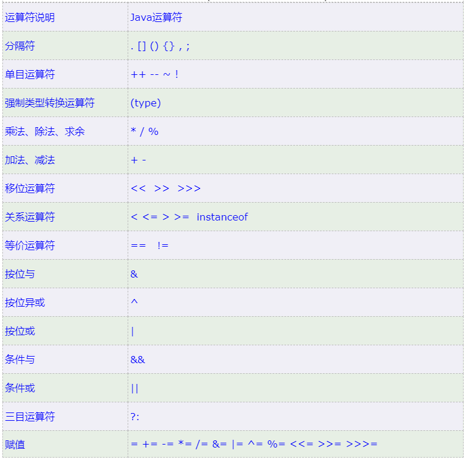

# 运算符
## 1. 算数运算符

除法默认结果是整数，因为表达式的最终结果由表达式的最高类型决定，整数默认为int型，除法表达式的结果也是int整数，含有小数的结果自动舍弃小数部分。 ^01093d

```java
int a =10;  
int b =3;  
System.out.println(a+b);//13  
System.out.println(a-b);//7  
System.out.println(a*b);//30  
System.out.println(a/b);//3-----因为3.3333自动转换为3

```

```ad-n
表达式先进行强制类型转换，后计算
```

```java
int a =10;  
int b =3;
float c = (float)a/b;//3.3333333333333335 假如是先运算，会得到3，转float变为3.0,但实际结果是3.3333证明先强转，后计算
double rs = a/b;  
System.out.println(rs);//3.0----因为表达式结果是3
```
这里发生的过程是
 float c = (float) b / a;
首先，因为a，b都是int类型，因此在开始前，会先把b的值进行==强制类型转化==为float类型的值(b的数据类型不会变，只是临时另外创建了一个float类型的值)，然后在计算前，这时候，分子是float类型 ，分母是int类型，所以又==自动类型转换==，并且由低转高，分母也被强制类型转为float类型了。因此最终的输出结果是3.3333333.（因为在计算中，不同类型的数据先转化为同一类型，然后才进行运算。）

相同的，如果是 float c = b / (float) a; 这时候呢？是先计算还是先强制类型转换？结论也是一样的，只不过这次是先强制类型转换的是a的值罢了。


>或者通过改表达式来得到含小数的结果,注意运算顺序

```java
System.out.println(a*1.0/b);//3.3333333333333335因为a先和1.0运算，自动类型转换 ， 小转换为大

System.out.println(a/b*1.0);//3.0 因为a/b先运算完了得到3然后和1.0运算
```


>案例
```java
拆分三位数，分别输出个位十位百位  
 int data = 123;  
 // 个位：123 /10 取余  
 System.out.println(data % 10);//商12余3  
 //十位 123/10 %10 取余  
 System.out.println(data /10 % 10); //123/10==12, 12/10 商1余2  
 //百位  
 System.out.println(data/100); // 整数除法保留整数

```


## 2. 加号作连接符
“+” 与==字符串==运算的时候，做连接符，结果仍是==字符串==

```ad-n
能算则算，不能算则在一起
```
>能算则算时注意与单个字符运算时遵循ASCII码表


  

^ASCII

```java
int a = 5;  
System.out.println("abc"+ "a");//abca  
System.out.println("abc"+ a);//abc5  
System.out.println(5 + a);//10  
System.out.println("abc"+5 + 'a');//abc5a  
System.out.println("abc"+5 + a);//abc55  
System.out.println(5+"abc"+5 );//5abc5  
System.out.println('a'+ a);//102 单个字符是用ASCII码a=97  
System.out.println("a"+ a);//a5 字符串引号做字符串处理，不能用ASCII  
System.out.println('a'+ "" + a);//a5 中间没有空格，'a'和""运算得到的是字符串"a"+a  
System.out.println( a+ 'a' +"abc");//错5aabc---对102abc  
System.out.println( "abc"+ a+ 'a');//abc5a  
System.out.println( "abc"+ (a+ 'a'));//错abc10----对abc102
```

## 3. 自增自减

<!--哈哈我是注释，不会在浏览器中显示。

表头|表头|表头
---|:--:|---:
内容|内容|内容
内容|内容|内容

第二行分割表头和内容。
- 有一个就行，为了对齐，多加了几个
文字默认居左
-两边加：表示文字居中
-右边加：表示文字居右
注：原生的语法两边都要用 | 包起来。此处省略

-->

符号|作用|说明|
:--:|:--:|:--:
++|自增|变量自身的值加一
--|自减|变量自身的值减一

>++ 和 -- ==单独使用时==既可以放在变量前面也可以放在变量后面 a++; 和++a;等同
>++ -- 只能操作变量，不能操作字面量

>注意，++--如果不是单独使用（放在表达式里，或同时由其他操作），放在变量前后会由明显区别

```ad-n
放在变量前----前置自增自减运算符----运算前进行自增自减
int a = 10;
int rs = ++a;// a = a+1,rs=a, rs = 11, a=11
```
```ad-n
放在变量后----后置自增自减运算符----用后进行自增自减，==注意！！某一部分用过变量的值之后立马进行自增自减，不要等整个表达式都计算完！==
int a = 10;
int rs = a++;// rs = a, a = a+1; rs = 10, a=11
```

>案例

```
int c = 10;  
int d = 5;  
int rs3 = c++ + ++c - --d - ++d +1 + c--;  
System. out. println(rs3);  //26
System. out. println(c);  //11
System. out. println(d);  //5
  
/* 方法：创建3行变量，随着变化更改变量值  
c 10--11--12--/--/--11  
d 5--/--/4---5  
rs 10+ (11+1)-4-5+1+12 = 26  
*/

```


## 4. 扩展赋值运算符


先运算后赋值

```java
int a = 10;  
int b = 200;  
a+=b; //a = (int) a+b;  
System.out.println(a);//210

```

隐含对结果整体进行强制类型转换，数据类型同加号左边的变量


```java
package basic;  
  
public class operator {
public static void main(String[] args) {
byte i = 11;  
 byte j = 22;  
//        i = i+j; //当操作数是byte,short,char时,会自动转化为int类型;返回结果为int。  
 i+=j;// 但是i+=j;是可以的因为i = (byte)(i+j); 强制转换的类型和i相同
 System.out.println(i);//33
System.out.println(getType(i));  
}  

//查看数据类型的方法
private static String getType(Object a) {  
    return a.getClass().toString();  
}
}

##结果
//33
//class java.lang.Byte

```

## 5. 关系运算符
对数据进行条件判断的符号，返回值为true or false 的布尔值。


```java
int a =10;  
int b =10;  
boolean rs = a==b;  
boolean rs2 = a>b;  
System.out.println(rs);//true  
System.out.println(rs2);//false
```


## 6. 逻辑运算符
可以把多个条件的布尔结果放在一起运算，最终返回一个布尔结果；


异或：如果a、b两个值不相同，则异或结果为1(true)。如果a、b两个值相同，异或结果为0(false)。

异或也叫半加运算，其运算法则相当于不带进位的二进制加法：二进制下用1表示真，0表示假
0⊕0=0，1⊕0=1，0⊕1=1，1⊕1=0（同为0，异为1）


### 短路逻辑运算符
运算结果一样，但是通过左边能判断出最终布尔值的时候，右边不执行


```java
----------短路与-------------
int a =10;  
int b = 20;  
System.out.println( a>100 && ++b >10);//false  
System.out.println(a);//10  
System.out.println(b);//20, 左边为false, ++b没有执行

----------单个与-----------------
System.out.println( a>100 & ++b >10);//false  
System.out.println(a);//10  
System.out.println(b);//21, 单个与会执行右半部分


----------短路或--------------
System.out.println(a>=10 || ++b<100);//true  
System.out.println(b);//20, 左边为true，++b没有执行 

----------单个或-----------------

System.out.println(a>=10 | ++b<100);//true  
System.out.println(b);//21, 单个或执行右半部分
```


## 7. 三元运算符

```ad-def
条件表达式 ？值1: 值2；

计算条件表达式的结果，true 返回值1； false返回值2
```

```java
int score = 98;  
String rs = score>=60? "pass":"false";  
String rs2 = 58>=60? "pass":"false";  
System.out.println(rs);//pass  
System.out.println(rs2);//false
```
>案例
```java
 返回两者中的较大值
 int a =100;  
 int b = 10;  
 int rs = a>b? a:b;  
 System.out.println(rs);//100  
 }


--------------------------------------------
三个数求最大值  
int a = 10;  
int b = 20;  
int c = 30;  
int temp = a>b? a : b;  
int rs = temp>c? temp :c;  
System.out.println(rs);//30

--------------------------
三元运算符嵌套
int max = a>b? (a>c? a : c):(b>c ? b :c);  
System.out.println(max);//30
```

## 8. 运算优先级

单目乘除位关系，逻辑三目后赋值。

单目运算符:一次作用一个变量的运算符，又叫一元运算符  
单目：单目运算符+ –(正负数) ，++ --，！（逻辑非），~（按位取反）  
乘除：算数运算符：* / % + - （* / %优先级肯定是大于+-的）  
为：位运算符：~（按位取反）<<(左移) >>(右移)，^（也可以位运算，二进制异或）  
关系：关系运算符：> < >= <= == !=  
逻辑：逻辑运算符（除！）&& || & | ^  
三目：条件运算符A > B ? X : Y  
后：无意义，仅仅为了凑字数  
赋值：=  +=  -= *=  /=  %=  |=  &=  ^= 

^priority-level

说明：前优先级大于后，比如单目运算符~也是位运算符，~的优先级是单目级别的。



```java
System.out.println(10>3||10>3 && 10<3);//true 先算双与，后双或  
System.out.println((10>3||10>3)&& 10<3);//false 小括号双或，后双与
```

<br/>
<br/>

# API (application programming interface)应用程序编程接口
存在JRE里面
1. java 写好的程序（功能代码）可以直接调用
2. Oracle提供了API文档（说明书）

使用步骤
1. 导入包 import java.util.Scanner
2. 得到扫描对象
Scanner sc = new Scanner(System.in);
3. 创建变量，等待接收用户输入数据
int age = sc.nextInt();
String name = sc.next();


<br/>
<br/>

# 条件语句 if，  switch

## if 条件
条件满足，执行语句体里的代码，不满足，直接跳过if 结构，执行下一行代码

```ad-def
```java
if(条件布尔表达式){ 
//如果布尔表达式为true将执行的语句 
}

if(布尔表达式){ 
//如果布尔表达式的值为true
}else{ 
//如果布尔表达式的值为false
}

if(布尔表达式 1){ 
//如果布尔表达式 1的值为true执行代码 
}else if(布尔表达式 2){
//如果布尔表达式 2的值为true执行代码 
}else if(布尔表达式 3){ 
//如果布尔表达式 3的值为true执行代码 
}else { 
//如果以上布尔表达式都不为true执行代码 
}
```


<br/>
<br/>

## switch 分支
switch case 语句判断一个变量与一系列值中某个值是否相等，每个值称为一个分支。
```ad-def
```java
switch(expression){  
	case value :  
            //代码语句  
		 break;  
	case value :  
            //代码语句  
		 break;   
	 //你可以有任意数量的case语句  
	default : //可选  
		 //代码语句  
 }
```

执行流程

1. 计算表达式的结果值，拿着这个值去与case后的值进行匹配。
2. 匹配哪个case的值为true就执行哪个case,遇到 break就跳出 整个switch分支。
3. 如果case后的值都不匹配则执行 default代码。
4. 不管default放在什么位置，它总是在最后一个处理（条件都不满足），然后继续向下处理！直到遇到break,或者switch结束


>if 更适合做区间匹配
>switch适合做值匹配的分支选择

```ad-n
1.
switch 语句中的变量类型可以是： byte、short、int 或者 char。从 Java SE 7 开始，switch 支持字符串 String 类型了， 不支持double,float, long（因为java小数运算本身不精确，和case没法精准比对）

2. case 给出的值不允许重复，并且必须为字符串常量或字面量。case值的数据类型必须与switch变量的数据类型相同

3. 不要忘记写break，否则会出现穿透现象。

4. default 在没有 case 语句的值和变量值相等的时候执行。default 分支不需要 break 语句。
```

==如果 case 语句块中没有 break 语句时，匹配成功后，从当前 case 开始，后续所有 case 的值都会输出。如果后续的 case 语句块有 break 语句则会跳出判断。==

```java
int i = 1;  
 switch (i){  
            case 1 :  
                System.out.println('1');  
//                break;  
 case 2:  
                System.out.println('2');  
//                break;  
 case 3:  
                System.out.println('3');  
//                break;  
 default:  
                System.out.println("default");
```
```java
输出结果
1
2
3
default

```

>switch 穿透性可以用于某些特殊情况，精简代码

如果代码执行到没有写 break的case块，==执行完后将直接进入下ー个case块执行代码（而且不会进行任何匹配）==，直到遇到 breakオ跳出分支，这就是 switchi的穿透性。

switch穿透性能解决什么问题？
==存在多个case分支的功能代码是一样时==，可以用穿透性把流程集中到同一处处理，这样可以简化代码。

```java
int month = 7;  
switch (month){  
    case 1 :  
    case 3 :  
    case 5 :  
    case 7:  
    case 8 :  
    case 10 :  
    case 12 :  
        System.out.println(month +"月是31天");  
 break; case 2:  
        System.out.println(month + "月有28天");  
 break; case 4:  
    case 6:  
    case 9:  
    case 11:  
        System.out.println(month + "月有30天");  
 break;
```

```java
输出结果
7月是31天
```


<br/>
<br/>

# 循环控制语句
## for 循环
```ad-def
```java
for (初始化语句; 布尔循环条件表达式; 迭代语句){
循环体代码（重复执行的语句）
}

```


```java
// 重复输出3次hello world  
for(int i =0; i<3; i++){  
    System.out.println("Hello world");
/*  
输出结果  
Hello world  
Hello world  
Hello world  
 */
```

>案例 1. 求和1---5
```java
//求和1-5，并输出  
int rs = 0;  
for(int i =1; i< 6; i++){  
    rs += i; //rs = rs + i;  
}  
System.out.println("1---5的和是"+ rs);
//输出结果
//1---5的和是15
```

>案例2. 

```java
//求1-10 奇数和  
int sum = 0;  
for (int i = 1; i <= 10 ; i++) {  
    if (i % 2 != 0) {  
        sum += i;  
 }  
}  
System.out.println("1-10 的奇数和是" + sum);

//输出结果
//1-10 的奇数和是25
```
注意这里==不要把筛选奇数的条件放进for循环布尔条件里==，那样的话，一旦不满足条件就会结束循环，而不是进行下一次循环

```ad-donot
~~for (int i = 1; i <= 10 && i % 2 != 0; i++)~~
```

可以通过改迭代器的值来实现筛选
```java
for (int i = 1; i <= 10; i+=2)
```


> 案例3 水仙花数
> 需求：在控制台输出所有的“水仙花数”，水仙花数必须满足如下2个要求
> 1. 水仙花数是一个三位数
2. 水仙花数的个位、十位、百位的数字立方和等于原数

```java
//3. 水仙花数  
 for (int i = 100; i <= 999 ; i++) {  
        int ge = i % 10;  // 个位数=总数 % 10 
 int shi = i /10 %10;  // 十位数=总数/10 %10
 int bai = i /100;  //百位数=总数/100
 if (ge*ge*ge + shi*shi*shi + bai*bai*bai ==i){  
           System.out.print(i + "\t");
 }

//输出结果
//153  370	371	407	
```
```ad-n
在同一行水平输出数据的时候，记得要加空格，一般用\t表示加一个tab键的空格， ==但是不要用单引号加空格 ' '， 因为字符空格会被当成ASCII码 “空格(Space)的ASCII码值是:32”==， 可以用双引号加空格，这时是字符串，不会参与运算
```


```ad-n
拓展，要求知道水仙花数的个数
定义count变量，统计输出次数，满足条件时count++
```
```java
//3. 水仙花数  
 int count = 0;  
 for (int i = 100; i <= 999 ; i++) {  
        int ge = i % 10;  
 int shi = i /10 %10;  
 int bai = i /100;  
 if (ge*ge*ge + shi*shi*shi + bai*bai*bai ==i){  
            System.out.print(i + "\t");  
 count++;  
 }  
    }  
    System.out.println("\n" +"水仙花数的个数是"+count);  
}
```

<br/>
<br/>


## while 循环

```ad-def
```java
初始化语句;
while( 布尔表达式 ) { 
//循环内容 
迭代语句;
}
```

重复输出3次hello world
```java
int i = 0;  
while (i<3){  
    System.out.println("Hello world");  
 i++;  
}
```

```ad-n
1. while循环因为初始化语句在循环体外，所以多个循环体需要多个初始化变量i，j, k....
2. while循环绝对不要忘记迭代语句，否则会陷入死循环
```
>一般来说，知道需要循环多少次的时候用for循环，
>不知道需要循环多少次的时候用while循环


>案例1. 珠穆朗玛峰
世界最高山峰是珠穆朗玛峰(8848.86米=8848860毫米)，假如我有一张足够大的纸，它的厚度是0.1毫米。请问，折叠多少次，可以折成珠穆朗玛峰的高度

```java
// 案例1：珠穆朗玛峰  
 double i = 0.1;  //纸张高度
 int count = 0;  
 while (i<=8848860){  //当纸张高度小于珠峰高度时
            i = 2*i;// i*= 2  //折叠一次厚度加倍
 count++;  
 }  
        System.out.println("一共需要"+count+"次");  
 System.out.println("纸张的最终厚度是" + i);


//输出结果
//一共需要27次
//纸张的最终厚度是1.34217728E7

```


<br/>
<br/>

## do while 循环
先执行再判断循环条件
```ad-def
```java
初始化语句;
do { 
循环内容 
迭代语句;
}while (循环条件)
```
```ad-n
==do while 循环一定会先执行一次循环！！！==
```


输出3次hello world
```java
int i = 0;  
do {  
    System.out.println("Hello world");  
 i++;  
}while(i<3);
```


##  3种循环的区别对比


## 死循环
一直循环执行下去，没有干预不会停止

常用于服务器（因为它需要一直开着，相当于一个死循环）

定义死循环
```java
经典写法：

while(true){  
    System.out.println("死循环");  
}


方法二：
for( ; ;){  
    System.out.println("死循环2");  
}


方法三：
do{
System.out.println("死循环3");
}while(true);

```

>案例1
>需求：系统密码是666666,请用户输入密码验证，验证不对输出密码错误，并不断继续验证， 验证成功输出欢迎进入系统，并停止程序

```java
int correct_pin = 666666;  
Scanner sc = new Scanner(System.in);//sc 对象是相同的，可以放在外面只创建一次  注意System大写
while(true){  
    System.out.println("请输入密码：");  
 int pin = sc.nextInt();//pin是每次循环都需要输入的，是不同的，放在循环内部  
 if (pin == correct_pin){  
        System.out.println("密码正确，登陆成功");  
 break;//立即结束循环  
 }else{  
        System.out.println("密码错误，请重新输入");  
 }  
}
```

```java
输出结果
请输入密码：
111111
密码错误，请重新输入
请输入密码：
666666
密码正确，登陆成功

```
<br/>
<br/>

## 循环嵌套

> 特点：外部循环每执行一次， 内部循环全部执行完一次

>案例每天3次我爱你，一共五天  

```java
//外部循环是每一天，执行一次， 内部循环执行3次我爱你  
for (int i = 0; i < 5; i++) {  
    System.out.println("第"+ (i+1) + "天");  
 for (int j = 0; j < 3; j++) {  
        System.out.println("我爱你"+ (j+1));  
 }
```

>案例2 打印4行5列*号 

```java
// 案例2 4行5列*号  
for (int i = 0; i < 4; i++) {  
    for (int j = 0; j < 5; j++) {  
        System.out.print("*");  
 }  
    System.out.println();//换行  
}
```


<br/>
<br/>

## break and continue

```ad-def
break: 跳出并结束==当前==所在循环
continue:用于跳出当前循环的当次执行，进入下一次循环。
```

注意：break:只能用于结束当前所在循环，或者结束所在 switch分支的执行；
continue:只能在循环中进行使用。


```ad-n
continue使用的时候，要注意if条件放在循环体前面，先判断是否满足条件，否则先执行了循环再结束当前循环就没意义了
```

> 案例1 洗碗5天，第三天过生日不洗，后面接着洗 
```java
// 洗碗5天，第三天过生日不洗，后面接着洗  
 for (int i = 1; i <=5 ; i++) {  
            if(i==3){  
                System.out.println("过生日，不洗");
continue; }  
            System.out.println("洗碗第"+i + "天");  
 }
```

```java
输出结果
洗碗第1天
洗碗第2天
过生日，不洗
洗碗第4天
洗碗第5天
```

<br/>
<br/>


注意！！在循环嵌套时，如果希望用break,continue结束外部循环，需要在外部循环前面定义标签，然后用break “标签”来结束外部循环


```ad-n
break默认是结束当前循环，有时我们在使用循环时，想通过内层循环里的语句直接跳出外层循环，java提供了使用break直接跳出外层循环，此时需要在break后通过标签指定外层循环。java中的标签是一个紧跟着英文冒号的标识符，与其他语言不同的是，java中的标签只有放在循环语句之前才有作用。需要注意的是，break后标签必须是一个有效的标签，即这个标签须在break语句所在循环的外层循环之前定义。

continue是结束当前循环的单次循环，同理，continue也可以结束外部循环的当前单次循环。

```


# Random 类 随机数字

作用： 用于生成一个随机数字

使用步骤
1. 导包： import java.util.Random;
2. 创建一个新的随机数对象：Random r = new Random();


3. 调用随机数对象，用变量接收值 int i = r.nextInt(10);

nextInt(n) 用于生成0--n-1的随机数


```java
Random r = new Random();  
int i = r.nextInt(10);
```
选中代码
把代码放进循环的快捷键 Ctrl+Alt +t


生成任意区间的随机数的方法
减到0 之后右边界加一找到N, 后面再把减的加回去，

>例如生成3-17 之间的随机数
3-----17
0-----14---n=15
int data = r.nextInt(15)+3;

>拓展：int data = r.nextInt(10, 30); 可以生成10-29的随机数字

>案例
>随机生成一个1-100之间的数字，提示用户猜测，猜大提示过大，猜小提示过小，直到猜中结束游戏。

```java
Random r = new Random();  
//1-100---0-99  
int num = r.nextInt(100)+1;  
System.out.println("答案是"+ num);  
  
Scanner sc = new Scanner(System.in);  
while(true){  
    System.out.println("请输入猜的数字1-100：");  
 int guess = sc.nextInt();  
  
  
 if (guess < num){  
        System.out.println("猜小了");  
 }else if(guess > num) {  
        System.out.println("猜大了");  
 }else if(guess == num){  
        System.out.println("猜对了");  
		break; 
 }
```


<br/>
<br/>

# 数组

## 定义
数组是用来存储固定大小的同一数据类型元素的内存区域。

数组分为  
1. 静态初始化数组： 定义数组的时候就已经赋值。
2. 动态初始化数组：定义数组的时候，只==确定数组的类型和元素个数==，之后再存入数据。


```ad-def
title:静态初始化数组

完整格式：
数据类型 []  数组名 = new 数据类型 [] {元素1， 2，...};

<br/>

简化格式
数据类型 [] 数组名 = {元素1， 2，...};
```
```java
int [] age = new int [] {18, 19, 20};
String [] names = {"tom"}
```


```ad-n
数据类型 [] 数组名”也可以写成 “数据类型 数组名 []”。
```


数组名称变量中存储的是， 数组对象在内存的首地址，数组是==引用类型==。


```java
验证
String [] names = {"tom"};  
System.out.println(names);

输出结果
[Ljava.lang.String;@776ec8df
```

## 数组访问

1. 访问数组值
```ad-def
数组名[索引]
索引从0开始
```

2. 数组长度（元素个数）
```ad-def
数组名.length
```
数组的最大索引可以用 数组名.length-1 来表示（元素个数大于0）

3. 改变数组元素的值
```ad-def
数组名[索引] = 新的赋值
```

```ad-n
注意：数组一旦定义出来，程序执行过程中，数组的==长度，类型==就是固定的！！！
```

## 动态初始化数组
1. 动态初始化数组：定义数组的时候，只==确定数组的类型和元素个数==，之后再存入数据。

```ad-def
title: 动态初始化数组

数据类型 [] 数组名 = new 数据类型[长度];

（其实默认值是0）
```

```java
int [] ages =new int [3];
```

>两种数组定义时的特点和场景有什么区别
当前已经知道存入的元素值，用静态初始化。
当前还不清楚要存入哪些数据，用动态初始化


## 动态初始化数组--元素默认值

<!--
表头|表头|表头
---|:--:|---:
内容|内容|内容
内容|内容|内容
-->

数据类型| 明细| 默认值
:---:|:---:|:---:
基本类型|byte, short, char, int, long|0
基本类型|double, float |0.0
基本类型|boolean|false
引用类型|类，接口，数组，==String==| null


>两种初始化的的使用场景总结、注意事项说明:
>
动态初始化：只指定数组长度，后期赋值，适合开始知道数据的数量，但是不确定具体元素值的业务场景。
>
>静态初始化：开始就存入元素值，适合一开始就能确定元素值的业务场景。
两种格式的写法是独立的，不可以混用。


<br/>
<br/>

## 数组遍历traverse

```ad-def
```java
int [] ages = {20, 30, 40};
for (int i = 0; i < ages.length; i++) {  
    System.out.println(ages[i]);  
}
```

==快捷键 ages.fori  加上tab==


> 案例一：需求：某部门5名员工的销售额分别是：16、26、36、6、100,请计算出他们部门的总销售额

```java
int [] arr = new int[] {16, 26, 36, 6, 100};  
int sum = 0;  
for (int i = 0; i < arr.length; i++) {  
    sum += arr[i];  
}  
System.out.println(sum);

//184
```


<br/>
<br/>

 ## 数组案例

 1. 数组求最值

 求最值的时候，需要定义ー个变量用于记录最值，这个变量建议==默认存储第一个元素值==作为参照。

 不建议自行定义为0， 因为假如都是负数，0会变成最大值，不准确。数据来源于数组本身最好。


 ```java
int [] scores = new int[]{15,9000, 10000, 20000, 9500, -5 };  
int max = scores[0];  
for (int i = 1; i < scores.length; i++) {  //循环从1开始，因为max默认为0号元素
    if (scores[i]> max){  
        max = scores[i];  
 }  
}  
System.out.println("最大值是："+ max); 
 ```


<br/>
<br/>

2. 案例2：猜数字游戏

需求
开发一个幸运小游戏，游戏规则如下
游戏后台随机生成1-20之间的5个数（无所谓是否重复），然后让大家来猜数字
未猜中提示：“"未命中”，井继续猜测
猜中提示：“运气不错，猜中了”，井输出该数据第一次出现的位置，且输出全部5个数据，最终结束本游戏。

分析
①随机生成5个1-20之间的数据存储起来-->使用数组
②定义ー个死循环，输入数据猜测，遍历数组，判断数据是在数组中，如果在，进行对应提示并结束死循环；如果没有猜中，提示继续猜测直到猜中为止。


```ad-n
break默认是结束当前循环，有时我们在使用循环时，想通过内层循环里的语句直接跳出外层循环，java提供了使用==break label==直接跳出外层循环，此时需要在break后通过标签指定外层循环。java中的标签是一个紧跟着英文冒号的标识符==label :==，与其他语言不同的是，java中的标签只有放在循环语句之前才有作用。需要注意的是，break后标签必须是一个有效的标签，==即这个标签须在break语句所在循环的外层循环之前定义==。

continue是结束当前循环的单次循环，同理，continue也可以结束外部循环的当前单次循环。

```


注意！！在循环嵌套时，如果希望用break,continue结束外部循环，需要在外部循环前面定义标签，然后用break label 来结束外部循环

```java

//1. 随机生成5个1-20之间的数据存储起来-->使用数组
Random r = new Random();  
 int [] nums = new int [5];  
 //动态初始化 得到5个随机幸运数字  
 for (int i = 0; i < nums.length; i++) {  
            nums[i] = r.nextInt(20)+1;  
 System.out.print(nums[i]+"\t");  //给自己看的，不需要其实
 }  
        System.out.println();  
  
  
 Scanner sc = new Scanner(System.in);  
  
// 2. 用死循环来实现一直猜，而不是用for循环，不然会用每次输入和对应i的值比较  
 OUT:// break label 用来结束外部循环  
 while(true) {  
            System.out.println("请猜出幸运数字1-20：");  
 int input = sc.nextInt();  
  
 //外部输入一次，和所有i值比较一次，遍历数组  
 for (int i = 0; i < nums.length; i++) {  
                if (input == nums[i]){  
                    System.out.println("猜对了！幸运数字索引是"+ i );  
//                    System.out.println("所有幸运数字为：");  
//                    for (int j = 0; j < nums.length; j++) {  
//                        System.out.print(nums[j] + "\t");  
//                    }放在循环外面，代码更简洁干净  
 break OUT;}  
            }  
  
            System.out.println("猜错了继续猜");  
 }  
        //循环结束，代表猜对了，可以公布答案  
 System.out.println("所有幸运数字为：");  
 for (int j = 0; j < nums.length; j++) {  
                        System.out.print(nums[j] + "\t");  
 }
```


<br/>
<br/>

3. 案例3：随机排名


分析
①在程序中录入5名员工的工号存储起来-->使用数组。
②依次遍历数组中的每个元素，每次都随机一个索引数据，让当前元素与该索引位置处的元素进行交换。


==注意，1. 打乱顺序是通过元素随机交换实现的
2.元素交换值注意中间变量的使用==


```java
int [] ids = new int[5];  
Random r = new Random();  
Scanner sc = new Scanner(System.in);  
  
//录入数据  
  
for (int i = 0; i < ids.length; i++) {  
    System.out.println("请录入第"+ (i+1) + "名学生学号");  
 ids[i] = sc.nextInt();  
}  
  
//看看数组结果  
System.out.println("参与的学生学号是");  
for (int i = 0; i < ids.length; i++) {  
    System.out.print(ids[i] + "\t");  
}  
System.out.println();  
  
// 打乱顺序--交换两个位置上的值  
for (int i = 0; i < ids.length; i++) {  
    int j = r.nextInt(ids.length);//用length比5更好  
 //定义一个中间变量，存索引j处的数据  
 int mid = ids [j];  
 ids [j] = ids[i];  
 ids [i] = mid;  
}  
  
//看看数组结果  
System.out.println("打乱排序后是：");  
for (int i = 0; i < ids.length; i++) {  
    System.out.print(ids[i] + "\t");  
}  
System.out.println();
```

随机排名还可以用于比如：扑克牌洗牌


<br/>
<br/>

## 数组排序
数组排序就是对数组中的元素，进行升序（从小到大），或者降序（从大到小）的操作。

数组的排序技术
- 冒泡排序
- 选择排序
- 快速排序
- 插入排序
- ...


数组的搜索技术
- 二分查找
- 分块查找
- 哈希表查找
- ...


### 冒泡排序法
原理：比较两个相邻的元素，将值大的元素交换到右边

==特点：N个数字要排序完成，总共进行N-1趟排序，第 i 趟的排序次数为(N-i)次。(i 从1开始) N=array.length==


所以可以用双重循环语句，外层控制循环多少趟，内层控制每一趟的循环次数 

i=1 开始时
外部循环 for (i=1; i<arr.length; i++)
内部循环			for (j =0; j < arr.length-i; j++ )

i=0 开始时
外部循环 for (i=0; i<arr.length-1; i++)
内部循环			for (j =0; j < arr.length-1 -i; j++ )


(2)冒泡排序的优点：每进行一趟排序，就会少比较一次，因为每进行一趟排序都会找出一个较大值。如上例：第一趟比较之后，排在最后的一个数一定是最大的一个数，第二趟排序的时候，只需要比较除了最后一个数以外的其他的数，同样也能找出一个最大的数排在参与第二趟比较的数后面，第三趟比较的时候，只需要比较除了最后两个数以外的其他的数，以此类推……也就是说，没进行一趟比较，每一趟少比较一次，一定程度上减少了算法的量。


```java
 int [] arr = {5, 2, 3, 1};  
 //             0, 1,2, 3  
  
 //外部循环，确定是第几次排序, 4个数字，排3次  
 for (int i = 0; (i < arr.length-1); i++) {  
            //内部循环，每次排序，都从第一个值开始， 让这个值和每一个做比较  
 /*  
 i = 0 j= 0, 1, 2    3 
 i = 1, j =0, 1,     2 
 i = 2 ,j = 0        1 */
//            for (int j = 0; j < (arr.length-1); j++) { // 不要用length-1，这样会有多余的比较，例如i=2时后面的不需要排序  
 for (int j = 0; j < (arr.length-1-i); j++) {//每轮循环次数 n-i（i从1开始）  
 if (arr[j]>arr[j+1]){  
                    int temp = arr[j+1];  
 arr[j+1] = arr[j];  
 arr[j] = temp;  
 }  
            }  
        }  
        //输出数组看看  
 for (int i = 0; i < arr.length; i++) {  
            System.out.println(arr[i]);  
 }

```


<br/>
<br/>

## 数组内存

### java 内存

- 栈
- 堆
- 方法区
- 本地方法栈
- 寄存器


栈：存正在运行的方法， 局部变量，引用数据类型

一般来说，基本数据类型直接在栈中分配空间，局部变量（在方法代码段中定义的变量）也在栈中直接分配空间，当局部变量所在方法执行完成之后该空间便立刻被JVM回收，还有一种是==引用数据类型，即我们通常所说的需要用关键字new创建出来的对象所对应的引用也是在栈空间中（例如数组名）==，此时，JVM在栈空间中给对象引用分配了一个地址空间（相当于一个门牌号，通过这个门牌号就可以找到你家），在堆空间中给该引用的对象分配一个空间，栈空间中的地址引用指向了堆空间中的对象区（通过门牌号找住址）；

堆：一般用来存放用关键字new出来的数据。

方法区：class文件 、存放类的信息（代码）、类的成员变量与成员方法也被加载到方法区中, static变量、常量池（字符串常量）等


### 数组内存
以数组为例，观察java内存分配


### 两个数组变量指向同一个数组对象
因为数组变量名存储的是数组对象的地址
如果把数组变量arr1赋值给arr2
赋值的是地址
而不是产生一个新数组！！！


而两个地址相同，会指向同一个数组对象
所以对任意一个数组变量的任何操作，最终都作用在同一个数组身上


```java
int [] arr1 = new int[]{11, 22, 33};  
System.out.println("arr1"+ arr1);  
  
int [] arr2 = arr1;  
System.out.println("arr2"+ arr2);  
  
arr2[1] = 100;  
  
System.out.println("arr1[1]" + arr1[1]);


输出结果
arr1[I@6d311334
arr2[I@6d311334
arr1[1]100

```

<br/>
<br/>

## 数组使用常见问题

1. 问题1:如果访问的元素位置超过最大索引，执行时会出现 Arraylndexoutof Boundsexception（数组索引越界异常）


2. 问题2:如果数组变量中没有存储数组的地址，而是null, 在访问数组信息时会出现 Nullpointerexception（空指针异常）


相当于把连接栈和堆的线删掉了


但是一个指针坏了不影响另一个
```java
arr2 = null;  
System.out.println(arr1[0]);//11  
System.out.println(arr2[0]);//Cannot load from int array because "arr2" is null
```


<br/>
<br/>
<br/>
<br/>

# 方法
方法是一种语法结构，它可以把一段代码封装成一个功能，方便重复调用。

方法的优点：

1. 使程序变得更简短而清晰。
2. 有利于程序维护。
3. 可以提高程序开发的效率。
4. 提高了代码的==重用性==。


<br/>
<br/>


## 方法的定义和调用

### 定义
```ad-def
title: 方法

修饰符 　返回值类型　方法名 (参数类型 参数名){

	方法体（代码）
	return 返回值
}
```
例如：


注意：
- 方法的名字的第一个单词应以小写字母作为开头，后面的单词则用大写字母开头写，不使用连接符。
-   方法申明了返回值的类型，内部必须使用return 返回相应类型的数据。
- 形参列表可以有多个，甚至可以没有；如果有多个形参，多个形参必须用“，"隔开，且不能给初始化值。


<br/>
<br/>


-   方法包含于类或对象中
-   方法在程序中被创建，在其他地方被引用


***==方法直接定义在类里！！不要定义在main 方法里==***


方法的其他写法：

方法定义时：返回值类型、形参列表可以按照需求进行填写。

1. 可以无返回值，定义的时候返回值类型写做void, 此时方法内部不可以使用 return返回数据。
2. 可以无参数，直接空着
3. 方法如果没有参数，或者返回值类型申明为void可以称为无参数、无返回值的方法，依次类推。

```java

public class method {  
    public static void main(String[] args) {  
        // main 方法里调用  
 helloworld();  
 }

// 无参数，无返回值方法  
public static void helloworld (){  
    System.out.println("hello world");  
 System.out.println("hello world");  
 System.out.println("hello world");
}  
}
```


<br/>
<br/>


### 调用
>方法名（参数数据）

当程序调用一个方法时，程序的控制权交给了被调用的方法。当被调用方法的返回语句执行或者到达方法体闭括号时候交还控制权给程序。


当方法返回一个值的时候，方法调用通常被当做一个值。例如：

int larger = max(30, 40);

如果方法返回值是void，方法调用一定是一条语句。例如，方法println返回void。下面的调用是个语句：

System.out.println("欢迎访问菜鸟教程！");

```java
public class method {  
    public static void main(String[] args) {  
        // main 方法里调用  
 int result = sum(100,200);  
 System.out.println( result);  
 }  
  
        //main外面 定义求和方法  
 public static int sum(int a, int b){  
            int c = a +b;  
 return c;  
 }  
}
```


<br/>
<br/>
<br/>
<br/>


## 方法使用常见问题

方法常见问题

1. 方法编写时顺序无所谓。（只要方法定义了即可，不需要定义写在调用上面）

```java
public class method {  
    public static void main(String[] args) {  
        // main 方法里调用  
 int result = sum(100,200);  
 System.out.println( result);  
 }  
  
        //main外面 定义求和方法  
 public static int sum(int a, int b){  
            int c = a +b;  
 return c;  
 }  
}
```
<br/>
<br/>


2. 方法与方法之间是平级关系，不能嵌套定义。
==方法A不能定义在方法B 里面==。比如不能定义在main方法里面。

<br/>


3. 方法的返回值类型为void（无返回值），方法内则不能使用 return返回数据，（有return会报错）
如果方法的返回值类型写了具体类型，方法内部则==**必须使用 return 返回对应类型的数据。**==（没有rerun也会报错Missing return statement）

<br/>


4. return语句下面，不能编写代码，因为永远执行不到，属于无效的代码。
5. Java中return用于方法，两个作用：
 （1）返回方法指定类型的值（这个值总是确定的），也可以是对象  
       （2）结束方法的执行（仅仅一个return语句）

<br/>


6. 方法不调用就不执行，调用时必须严格匹配方法的参数情况。

<br/>


7. 有返回值的方法调用时可以选择定义变量接收结果，或者直接输出调用，甚至直接调用；无返回值方法的调用只能直接调用一下。

```java
int result = sum(100,200);//用变量接收  
System.out.println( sum(10, 20));//直接输出调用  
sum(50,60);//直接调用，只是调用方法，让方法跑一下，但是方法返回的结果没要 


helloworld();//无返回值方法的调用只能直接调用一下。是statement
```

<br/>
<br/>

## 方法案例

> 案例1：定义一个方法，计算1，2,....n 的和并返回

分析
1.根据格式编写方法---->关注参数和返回
因n不固定，故方法需要声明形参接收；要返回结果，还需申明返回值类型
2.方法内部使用for循环计算出1-n的和并返回。

```java
public static int add (int n){  
    int sum = 0;  
 for (int i = 1; i <= n; i++) {  
        sum += i;  
 }  
    return sum;  
}


public static void main(String[] args) {  
    //-------------------------------------------案例1：1---n求和  
 int sum = add(100);  
 System.out.println(sum);//5050
}
```

<br/>
<br/>

>案例2：需求：拿一个整数，然后调用方法，把整数交给方法在方法中输出该数为奇数还是偶数。

分析
1.根据格式编写方法，因要传入数据给方法，方法需要声明形参接收。直接在方法中输出结果即可，不需要返回值
2.方法内部使用if语句判断，并输出对应的结论。


```java
public static void evenOrodd (int a){  
        if (a%2 == 0){  
            System.out.println("数字" + a + "是偶数");  
 }else{  
            System.out.println("数字" + a + "是奇数");  
 }  
}


public static void main(String[] args) {
//案例2 ： 判断奇偶性并返回  
evenOrodd(1);//数字1是奇数  
evenOrodd(0);//数字0是偶数
}
```

<br/>
<br/>

>案例3： 需求
把找出数组的最大值案例，改造成方法，可以支持返回==任意整型数组==的最大值数据。

分析
1.根据格式编写方法
要返回最大值，需要申明返回值类型。
需要接收数组，需要申明形参列表
2.方法内部找出数组的最大值并返回。


```java
/定义
public static int getArrayMax(int [] arr){  
    int max = arr[0];  
 for (int i = 1; i < arr.length; i++) {  
        if (max < arr[i]){  
            max = arr[i];  
 }  
    }  
    return max;  
}


// 调用
int [] ages = {10, 30, 40, 100};  
int max = getArrayMax(ages);  
System.out.println(max);//100
```

流程：定义数组ages, 调用函数getArrayMax， ages传递给参数arr， **==传递的是地址， 此时是两个数组变量指向同一个数组内存==**


<br/>
<br/>

<br/>
<br/>

## 方法内存原理
方法的调用流程-内存图解
- 方法没有被调用的时候，在==***方法区***==中的字节码文件中存放
- 方法被调用的时候，需要进入到==***栈内存***==中运行


可以理解为，方法没有被调用时就像子弹存在弹夹里
调用时，子弹上膛，进入枪膛里。


> 以求和函数为例

1. 没有运行时，方法区存放了class文件，还有main方法，add方法。
2. 运行时，首先运行main方法，进入栈内存中，
3. 然后调用add方法，进入栈中
4. 运行完成后方法会从栈中退出。（用完一个立马退一个）


详情可见
https://www.bilibili.com/video/BV1Cv411372m?p=58


<br/>
<br/>

<br/>
<br/>

## 方法参数传递机制
java 参数传递机制分两种 
- 基本类型的参数传递
- 引用类型的参数传递

### 1. **基本类型和引用类型在内存中的保存**
Java中数据类型分为两大类，**基本类型和引用类型**。相应的，变量也有两种类型：基本类型和引用类型。  

基本类型的变量保存原始值，即它代表的值就是数值本身；原始值一般对应在内存上的栈区。

基本类型-->原始值--> 栈区

而引用类型的变量保存引用值（在栈区），"引用值"指向内存空间的地址，代表了某个对象的引用，而不是对象本身，  
对象本身存放在这个引用值所表示的地址的位置，在内存上的堆内存区。

引用类型-->引用值：存储对象在堆内存区的地址-->自身存在栈区　　　　　　　
对象本身--> 存数据-->在堆内存
			
**基本类型包括：byte,short,int,long,char,float,double,Boolean,returnAddress，**  
**引用类型包括：类类型，接口类型和数组。**

相应的，变量也有两种类型：基本类型和引用类型。


<br/>
<br/>


### 2. 基本类型的参数传递
```ad-n
Java的参数传递机制：值传递
在传输实参给方法的形参的时候，并不是传输实参变量本身，而是传输实参变量中存储的值，这就是值传递。

```
**形参** ：就是形式参数，用于定义方法的时候使用的参数，是用来接收调用者传递的参数的。在整个函数体内都可以使用，离开该函数则不能使用。

实参：实参出现在**主调函数中，进入被调函数后，实参变量也不能使用**。
实参可以是常量、变量、表达式、函数等，无论实参是何种类型的量，在进行函数调用时，它们都必须有确定的值，以便把这些值传送给形参。因此应预先用赋值，输入等办法使参数获得确定值。


>值传递：方法调用时，实际参数把它的值传递给对应的形式参数，函数接收的是原始值的一个==copy==， 此时内存中存在两个相等的基本类型，即实际参数和形式参数，==后面方法中的操作都是对形参这个值的修改，不影响实际参数的值。==


```java

int a =10;  
System.out.println("调用前a= " + a);//调用前a=10  
change(a);  
System.out.println("调用后a=" + a);//调用后a=10


public static void change(int a){  
 System.out.println("调用函数，传递来的a="+ a);  //调用函数，传递来的a=10
 a = 20;  
 System.out.println("函数内部更改a后，a =" + a);  //函数内部更改a后，a =20
}
```

函数接收的是原始值的一个==copy==， 此时内存中存在两个相等的基本类型，即实际参数和形式参数，后续在调用函数内部，对形参的操作，都不影响下面实参的值


<br/>
<br/>

### 3. 引用类型的参数传递
```ad-n
title: 引用传递
方法调用时，实际参数中存储的的引用(地址，而不是参数的值)被传递给方法中相对应的形式参数，函数接收的是原始值的内存地址

**在方法执行中，形参和实参内容相同，指向同一块内存地址，方法执行中对引用的操将会影响到实际对象**。

```
本质上也是值传递，但是传递的是地址值。


```java

int [] arr = new int[]{10, 20, 30};  
System.out.println("调用函数前，数组第一个值为"+ arr[0]);//调用函数前，数组第一个值为10  
change2(arr);  
System.out.println("调用方法后，数组第一个值为" + arr[0]);//调用方法后，数组第一个值为11111


public static void change2(int [] arr){  
    System.out.println("调用方法，传递来的数组第一个值是" + arr[0]);  //调用方法，传递来的数组第一个值是10
 arr[0] = 11111;  
 System.out.println("方法内部更改数组第一个值后，是"+ + arr[0]);  //方法内部更改数组第一个值后，是11111
}
```


<br/>
<br/>

<br/>
<br/>

## 方法参数传递案例
> 案例1 ：需求
设计一个方法用于输出任意整型数组的内容，要求输出成如下格式
“该数组内容为：[11,22,33,44,55]”

分析
1、定义一个方法，要求该方法能够接收数组，并输出数组内容
需要参数吗？需要返回值类型申明吗？

--需要参数接收数组， 但不需要返回值，可以直接打印

2、定义一个静态初始化的数组，调用该方法，并传入该数组。


```java

int [] arr = new int[]{ 11, 22, 33, 44, 55};  
printarray(arr);

public static void printarray(int [] arr){  
        System.out.print("该数组内容为：[");  
 for (int i = 0; i < arr.length; i++) {  
//            System.out.print(arr[i] +", ");// [11, 22, 33, 44, 55, ]最后会多一个逗号，不要用两个循环来分别打印arr[i]和逗号，加个条件语句即可  
 if(i== arr.length-1){  
                System.out.print(arr[i]);  
 }else{  
                System.out.print(arr[i] +", ");  
 }  
        }  
        System.out.println("]");  
 }
```
注意，上面的条件部分，可以用三元运算符代替！简化代码

```
条件表达式 ？值1: 值2；

计算条件表达式的结果，true 返回值1； false返回值2
```
三元运算符是运算符！！==返回的是值！！！==
不要把打印语句放在后面的值的位置，而是放在前面，先是打印命令，打印的是什么呢？ 是三元运算符返回的值。

额外补充，保证数组非空指针null且长度大于零

```java
public static void printarray(int [] arr){  
        System.out.print("该数组内容为：[");  

if(arr != null && arr.length > 0){  
            for (int i = 0; i < arr.length; i++) {  
//            System.out.print(arr[i] +", ");// [11, 22, 33, 44, 55, ]最后会多一个逗号，不要用两个循环来分别打印arr[i]和逗号，加个条件语句即可  
//            if(i== arr.length-1){  
//                System.out.print(arr[i]);  
//            }else{  
//                System.out.print(arr[i] +", ");  
//            }  
 System.out.print(i == arr.length-1? arr[i] : arr[i] +", ");  
 }  
        }
		System.out.println("]");  
 }
```

<br/>
<br/>

>案例2： 需求
设计一个方法可以查询元素值在数组中的索引；最终要返回元素在该数组中的索引，如果数组中不存在该元素则返回-1


分析
1、定义方法，接收整型数组，查询的元素值，在方法体中完成元素查询的功能。--->是否需要参数、返
回值类型？

-- 需要接收参数，2个，并且也需要返回值 ，2种

2、定义数组，调用该方法，并指定要搜索的元素值，得到返回的结果输出。

问题1： num要和每一个值比较，相同输出i，但不同的时候要所有值都不同才输出-1  
>解决方法， 不同的时候要和所有值都不同，*那就放在循环外面*

问题2： return的使用，它结束方法了，怎么条件返回两个值? 而且必须在for外面return？
>注意一个误区：***return可以不只有一个！*** return可以结束方法，但可以不只有一个， （比如存在不同条件下不同return）， 先执行到的return就会直接跳出代码块，不再执行代码块以下的其他代码

```ad-n
title: 正确答案
```

```java
int [] arr = new int[]{ 11, 22, 33, 44, 55};  
System.out.println(checkIndex(arr, 11));  //0
System.out.println(checkIndex(arr, 10));  //-1


public static int checkIndex(int [] arr, int num){  
        for (int i = 0; i < arr.length; i++) {  
            if (arr[i] == num) {  
                return i;  
 }  
        }  
        return -1;  
}
```
<br/>
<br/>

```ad-donot

并不是必须要在for循环外return, 但是for 循环搭配return会有坑。

以下面**错误代码**为例：
```java
public static int checkIndex(int [] arr, int num){  
        for (int i = 0; i < arr.length; i++) {  
            if (arr[i] == num) {  
                return 0;  
			 }else{  
                return -1;  
			 }  
		    }  
}
//报错Missing return statement
```


1. 首先假设不考虑按照上面代码的写法，for循环只能执行一次的问题，仅仅来讨论一下，为什么报错报的是Missing return statement
2. 看起来这个方法，只要得到数组参数arr，进入方法就进for循环遍历，只要进入循环，无论是满足条件arr[i] == num进入if，或者不满足进入else，都有对应的return,为什么还会提示没有return 呢？

>原因是for循环的条件不一定满足，条件不满足的时候是不会执行循环体语句的！（例如传入一个空数组，length=0）这时会直接跳过循环，而这种情况下，方法并没有return，所以会报错


证明：假如在刚才代码的基础上，for循环外面再加一个return，传入一个空数组，看是否是预计的结果，这样可以证明我们刚才关于for循环使用return的猜测是否正确
```java
public static int checkIndex(int [] arr, int num){  
        for (int i = 0; i < arr.length; i++) {  
            if (arr[i] == num) {  
                return 0;  
 }else{  
                return -1;  
 }  
        }  
        return 2;  
}


// 空数组  
int [] arr2 = {};  
System.out.println(arr2.length);  //0
System.out.println(checkIndex(arr2, 1));//2
```

当然，即使考虑空数组也没必要写成上面这样，最开始的正确答案可以直接return -1.


此外，类似的还有条件语句需要注意，只有if， 没有else的时候，必须要写成情况1的形式，java认为if不会有任何情况下都能执行的能力。

而有else，java编译器对if else 语句能够全面囊括所有情况的能力只限定在的if...else【情况2】(或if...else if...else)【情况3】时，而不包括if...else if。即使你把所有条件都列出来，它也不认为涵盖所有情况

情况1和情况2是完全相同的。

```java

*******情况1
if(){
	return 1;
}
return 2；

*******情况2
if (){
	return 1;
}else {
	return 2；
}

*******情况3
if (){
	return 1;
}else if{
	return 2；
}else{
	return 3;
}
```


<br/>
<br/>

> 案例3：
需求
如果两个数组的类型，元素个数，元素顺序和内容是一样的我们就认为这2个数组是一模一样的。请使用方法完成：能够判断任意两个整型数组是否一样，并返回true或者 false。


分析
1、定义方法-->是否需要参数、返回值类型？

--需要接收参数，2个整型数组，需要布尔类型返回值

2、在方法内部完成判断的逻辑，并返回布尔结果。

问题1：java怎么判定相等，是值相等就是相等，还是包括元素类型？
>解决方法：因为传入参数都是整型数组，保证了元素类型一样。

问题2：因为不知道两个数组的长度，所以随便拿任意一个做循环的坐标都是不合适的，比如
```java
int [] arr1 = new int [] {1, 2, 3};  
int [] arr2 = new int [] {1, 2, 3, 4};
```
如果用arr1做循环的坐标
```java
public static boolean equalityCheck (int [] arr1, int [] arr2){  
    for (int i = 0; i< arr1.length; i++){  
        if (arr1[i] != arr2[i]){  
            return false;  
 }  
    }  
    return true;  
}
```
这样结果会有问题，arr1的索引只到2，在它索引范围内值都相同，但是实际上两数组并不一样

> 解决方法：先判断数组长度是否相同，相同的情况下再选任意一个数组遍历。


```ad-n 
title:正确答案
```

```ad-n
注意的问题
1： for循环中，if搭配return的时候，如果满足条件就返回会造成循环只能执行一次，注意要选择条件不满足才返回，直接结束循环。

2：当循环都执行完了，仍没有false，证明结果一定是true.

3. 注意考虑for循环不满足循环条件时的返回值。

```

```java

//自己的答案
public static boolean equalityCheck (int [] arr1, int [] arr2){  
    if (arr1.length != arr2.length){  //注意条件要写不等于
        return false;  
 }  //长度相等才能向下执行
    for (int i = 0; i< arr1.length; i++){  
        if (arr1[i] != arr2[i]){  
            return false;  
 }  
    }  
    return true;  // 
}

//标准答案
public static boolean equalityCheck2 (int[] arr1, int[] arr2){  
    if(arr1.length == arr2.length){//长度相等才比较  
 for (int i = 0; i < arr1.length; i++){  
            if (arr1[i] != arr2[i]) {  
                return false;//元素不等就false  
 }  
        }  
        return true;//所有的都遍历一次没有false，一定是true.  
 }  
    return false;//长度不等，或者不满足循环条件等其他情况，都是false  
}

```


<br/>
<br/>

<br/>
<br/>

## 方法重载
同一个类中，出现多个方法***名称相同，但是形参列表是不同的***，那么这些方法就是重载方法。
调用方法的时候会通过参数的不同来区分调用的具体是哪个方法。

案例导学
开发武器系统，功能需求如下
①可以默认发一枚武器。
②可以指定地区发射一枚武器。
③可以指定地区发射多枚武器。

```java
public static void fire(){  
    System.out.println("默认发射一枚导弹");  
}  
  
public static void fire(String location){// 形参：数据类型 形参名  
 System.out.println("指定地点" + location +"默认发射一枚导弹");  
}  
  
public static void fire(String location, int num){  
    System.out.println("指定地点" + location + "发射"+ num + "枚导弹");  
}


fire();  
String l1 = "沙漠";  
fire(l1);  
fire("不用变量行吗", 3);//行，可以是字符串，也可以是字符串变量，等同于直接传入数字1，和int num =1; 传入num;

结果
默认发射一枚导弹
指定地点沙漠默认发射一枚导弹
指定地点不用变量行吗发射3枚导弹
```

还可以在方法中调用重载方法
例如：
```java
public static void fire(String location){// 形参：数据类型 形参名  
 System.out.println("指定地点" + location +"默认发射一枚导弹");  
}  

可以改写为
public static void fire(String location){// 形参：数据类型 形参名  
fire(location, 1);  
}  

结果：
指定地点沙漠发射1枚导弹
```

方法重载的优点：

对于相似功能的业务场景：可读性好，方法名称相同提示是同一类型的功能，通过形参不同实现功能差异化的选择，这是一种专业的代码设计。


<br/>
<br/>

### 方法重载的识别技巧
1. 只要是同一个类中，方法***名称相同、形参列表不同***，那么他们就是重载的方法，其他都不管！(如：修饰符，返回值类型都无所谓)
2. 形参列表不同指的是：形参的**个数、类型***、***顺序***不同，不关心形参的名称。
```java
1. public static void open () {}//原始方法
2. public static void open(int a){}//是重载，形参个数不同
3. static void open(int a, int b){}//是重载，形参个数不同
4. public static void open(double a, int b){}//是重载，数据类型不同
5. public static void open(int a, double b){}//是重载，形参顺序不同
6. public void open(int i, double d){}//不是重载，形参和5同，重复方法
7. public static void OPEN(){}//不是重载，方法名称不同，区分大小写，新方法
```


<br/>
<br/>


### return 单独使用

>return关键字单独使用，不需要返回值：return; 
>可以立即跳出并结束当前方法的执行；
> return关键字单独使用可以放在任何方法中。


<br/>
<br/>

<br/>
<br/>


# 编程案例

## 案例1：买飞机票
需求
机票价格按照淡季旺季、头等舱和经济舱收费、输入机票原价、月份和头等舱或经济舱。
按照如下规则计算机票价格：旺季(5-10月)头等舱9折，经济舱8.5折，淡季(11月到来年4月)头等舱7折，经济舱6.5折。

自己分析：
1. 定义方法，有参数3个：原价，月份，经济or头等舱， 有返回值：最终票价
2. 用switch case 来分月份，利用穿透性

```ad-n
==比较的是两个字符串的地址是否为相等（同一个地址），equals()方法比较的是两个字符串对象的内容是否相同（当然，若两个字符串引用同一个地址，使用equals()比较也返回true）。

要比较字符串内容是否相等，应该用 string的equals方法

```

```java
public class cases {  
    public static void main(String[] args) {  
        // 手动输入原价,月份和头等舱或经济舱。  
 Scanner sc = new Scanner(System.in);  
  
 System.out.println("请输入机票原价");  
 double originPrice = sc.nextDouble();  
 System.out.println("请输入月份");  
 int month = sc.nextInt();  
 System.out.println("请输入飞机舱型，经济舱或头等舱");  
 String classes = sc.next();  
 System.out.println("您的机票优惠后价格为；" + price(originPrice, month, classes) );  
 }  
  
    public static double price(double originPrice, int month, String classes){  
        double price =0;  
 // 淡季  
 switch (month){  
            case 1:  
            case 2:  
            case 3:  
            case 4:  
            case 11:  
            case 12:  
//                if (classes == "经济舱"){// 不行，==比较内存地址  
 if (classes.equals("经济舱") ){// equals比较内容  
 price = originPrice * 0.65;  
 }else if(classes.equals("头等舱") ){  
                    price = originPrice * 0.7;  
 }else{  
                System.out.println("舱型有误，请重新输入");  
 price = -1;  
 }  
                break;  
 case 5:  
            case 6:  
            case 7:  
            case 8:  
            case 9:  
            case 10:  
                if (classes.equals("经济舱")){  
                    price = originPrice * 0.85;  
 }else if(classes.equals("头等舱") ){  
                price = originPrice * 0.9;  
 }else{  
                System.out.println("舱型有误，请重新输入");  
 price = -1;  
 }  
                break;  
 }  
        return price;  
 }  
  
  
}
```
>缺点：用switch case 分支来确定月份代码太长，繁琐， 中间的price可以用*=
>注意：== 和equals的使用。对引用类型数据，== 比较内存地址， equals比较对象的值。


答案分析
1. 键盘录入机票原价、月份和机舱类型
2. 使用判断月份是是旺季还是淡季，使用 switch分支判断是头等舱还是经济舱。
3. 选择对应的折扣进行计算并返回计算的结果。

```java
public static double cal(double money, int month, String type){  
        if(month >=5 && month <=10){  
            switch(type){  
                case "经济舱":  
                    money *= 0.85;  
 break; case "头等舱":  
                    money *= 0.9;  
 break; default:  
                    System.out.println("输入舱型有误，请重新输入头等舱或经济舱");  
 money = -1;  
 }  
        } else if(month >=1 && month <=4 || month ==11 || month==12){  
            switch (type){  
                case "经济舱":  
                    money *= 0.65;  
 break; case "头等舱":  
                    money *= 0.7;  
 break; default:  
                    System.out.println("输入舱型有误，请重新输入头等舱或经济舱");  
 money = -1;  
 }  
            }else{  
            System.out.println("您输入的月份有误，请重新输入1-12");  
 money = -1;  
 }  
        return money;  
 }  
}
```
>注意，case值比较，从 Java SE 7 开始，switch 支持字符串 String 类型了，同时 case 标签必须为字符串常量或字面量。可以直接比较字符串的内容。

<br/>
<br/>

## 案例2 求素数
1、判断101-200之间有多少个素数，并输出所有素数。

素数（质数）：如果除了1和它本身以外，不能被其他正整数整除，就叫素数。


分析
1. 设计一个方法，返回101-200输出所有素数
不需要参数，也可以不需要返回值

2. 需要循环遍历101-200，满足条件，输出，进行下一次循环，不满足条件，直接进入下一次循环
3. 问题：怎么判断素数
判断规则是：从2开始遍历到该数的一半的数据，看是否有数据可以整除它，有则不是素数，没有则是素数。


思路1)：因此判断一个整数m是否是素数，只需把 m 被 2 ~ m-1 之间的每一个整数去除，如果都不能被整除，那么 m 就是一个素数。

思路2)：另外判断方法还可以简化。m 不必被 2 ~ m-1 之间的每一个整数去除，只需被 2 ~ $\sqrt m$ 之间的每一个整数去除就可以了。如果 m 不能被 2 ~ $\sqrt m$ 间任一整数整除，m 必定是素数。例如判别 17 是是否为素数，只需使 17 被 2~4 之间的每一个整数去除，由于都不能整除，可以判定 17 是素数。

原因：因为如果 m 能被 2 ~ m-1 之间任一整数整除，其二个因子必定有一个小于或等于$\sqrt m$ ,另一个大于或等于$\sqrt m$ 例如 16 能被 2、4、8 整除，16=2 $*$ 8，2 小于 4，8 大于 4，16=4$*$ 4，4=$\sqrt16$，因此只需判定在 2~4 之间有无因子即可。

如果一个数大于等于4,它的平方根 肯定不会超过它自己,且一个数的平方根最多不会超过它的一半

>问题：内部循环验完了所有除数，都不满足，在for循环外声明他是素数，但内部循环条件满足，break后也会跳出循环，到达for循环外，这里有个交叉情况

>==解决办法：采用信号位flag：标记来解决，满足条件改变标记，不满足则不改变标记，后面声明素数的时候，选择输出==

```java
public static void primeNumber(){  
        int num = 0;  
 System.out.println("101-200之间的素数有:");  
 //1. 取到101-200 所有值  
 for(int i = 101; i<=200; i++){  
            //2. 判断是不是素数  
 boolean flag = true;//假设一开始是素数  
 for(int j = 2; j<= i/2; j++){//j可以不用等，因为i如果是偶数，在2的时候就已经被筛出去了，i如果是奇数，9/2=4.5，j=4,也足够用  
 if (i%j==0){  
                    flag = false;  
 break;//不是素数，验下一个i  
 }  
            }//所有除数除一遍，没有跳出循环,则是素数，但是break后也会跳到这里，不对  
//            System.out.println(i);  
//            num +=1;  
//          3。 判断结果输出到这里，多了flag后多了一个可以选择输出的方式  
 if(flag){//if true 执行，也就是flag=true才输出  
 num +=1;  
 System.out.print(i + "\t");  
 }  
        }  
        System.out.println("共计"+ num +"个素数");  
  
  
 }  
}
```


<br/>
<br/>

## 案例3 开发验证码
需求
定义方法实现随机产生一个5位的验证码，每位可能是数字、大写字母、小写字母。

分析：
1. ①定义一个方法，生成验证码返回：方法参数是位数、方法的返回值类型是 String。

2. for 循环生成每一位验证码，连接起来成为一个字符串
3. 返回字符串

> 重点在怎么随机，随机数字可以，字母也可以，但是怎么混在一起，还是固定位置是数字，剩下的是字母？

>解决办法，两次随机嵌套，第一次决定这一位是什么类型，第二次决定具体是什么随机值
>大小写字母，用随机数根据ascii码生成，并最终以字母形式输出，强转char
>字符串变量可以直接接数字


```java
public static String verifyCode(int num) {  
    Random r = new Random();  
 String code = "";  
 for (int i = 1; i <= num; i++) {  
        // 数字，小写，大写 0， 1， 2 int type = r.nextInt(3);//0-2  
 if (type == 0) {  
            code += r.nextInt(10);  
 } else if (type == 1) {  
            code += (char) (r.nextInt(26) + 97);//(a:97---z:97+25)  
 } else {  
            code += (char) (r.nextInt(26) + 65); //(A65--z:65+25)减加法--0-25+65  
 }  
    }  
    return code;  
}
```
还可以用case代替if


<br/>
<br/>

## 案例4：数组复制
需求
把一个数组中的元素复制到另一个新数组中去。

分析
1. 定义一个方法，需要接收参数，数组类型， 需要返回一个数组，新复制的
2. 定义一个新数组，接收copy值，***动态初始化，长度与原数组一样***
3. for 循环依次读取数组中的每个值，并写入copy中

```ad-donot
注意数组复制，是有两个对象的

int[] arr1 = {0,1,2};
int[] arr2 = arr1; 不是数组复制，只是指向了同一个对象
```


```java
 public static void main(String[] args) {  
    int [] arr = {0,1,2,3};  
 int [] arr2 = copyArray(arr);  
 System.out.print("原数组："+ "\t");  
 printArray(arr);  
 System.out.println();  
 System.out.print("新复制数组："+ "\t");  
 printArray(arr2);  
  
 }  


//---------------复制新数组----------------
    public static int[] copyArray(int[] arr){  
        int [] copy = new int[arr.length];  
 for (int i = 0; i< arr.length; i++){  
            copy[i] = arr[i];  
 }  
        return copy;  
 }  


//----------------打印数组，注意末尾逗号------------
    public static void printArray(int[] arr){  
        System.out.print("[");  
 for (int i = 0; i < arr.length; i++) {  
            System.out.print(i== arr.length-1? arr[i]:arr[i]+"," );  
 }  
        System.out.println("]");  
 }  
} 


//输出结果
原数组：	[0,1,2,3]

新复制数组：	[0,1,2,3]
```


<br/>
<br/>

## 案例5 评委打分
需求
在唱歌比赛中，有6名评委给选手打分，分数范围是[0-100]之间的整数。选手的最后得分为：去掉最高分、最低分后的4个评委的平均分，请完成上述过程并计算出选手的得分。

自己分析：
1. 键盘录入分数，数组接收
1.  需要参数 接收分数数组，返回最终得分
2. 冒泡排序，得到新的分数数组
3. 再次for循环遍历，从第二个到倒数第二个求和，求平均


```java
public class case5 {  
    public static void main(String[] args){  
//         1. 录入分数，存进数组  
 Scanner sc = new Scanner(System.in);  
 int[] arr = new int[6];  
 for(int i =0; i<arr.length; i++){  
            System.out.println("请输入第"+ (i +1) +"个评委评分");  
 arr[i]=sc.nextInt();  
 }
	System.out.println(score(arr));
}


 public static double score(int[] score){  
        //2. 分数冒泡排序,双循环！！外--循环n-1次，内--比较n-i次  
 for (int i=0; i<score.length-1; i++){  
            for(int j=0; j<score.length-1-i; j++){//减i！！！！！！！！！！  
 if(score[j]>score[j+1]) {  
                    int temp = score[j+1];  
 score[j+1] = score[j];  
 score[j] = temp;  
 }  
            }  
        }  
        printarr(score);  //输出重新排序结果看看
 //3. 求和，平均  
 int sum = 0;  
 for(int i=1; i<score.length-1;i++){  
//            if(i>0 && i<score.length-2) //不用条件，直接改遍历范围  
 sum += score[i];  
 }  
        return (double)sum/(score.length-2);//不加double除法默认结果是整数，先强转后计算  
 }


  
    // 数组输出函数  
 public static void printarr(int[] arr){  
        System.out.print("[");  
 for(int i=0; i<arr.length; i++){  
            System.out.print( i==arr.length-1? arr[i] : (arr[i] +","));  
 }  
        System.out.print("]");  
 }  
}
```


注意，有更简单的方法，不需要冒泡排序，只要找到min,max,sum就可

也不需要数组的数之间互相比较，直接用每个数与max,min比较就行

```java
public static double score2(int[] score){  
    int sum =0;  
 int max =score[0];  
 int min = score[0];  
 //不需要数组之间的数互相比较，一直跟max,min 比就行  
 //注意不用从i=1开始，因为虽然不影响最大最小，但影响sum  
 for(int i=0; i<score.length; i++){  
        if(score[i]>max){  
            max = score[i];  
 }  
        if(score[i]<min){  
            min = score[i];  
 }  
        sum+=score[i];  
 }  
    return (double)(sum-min-max)/(score.length-2);  
}

```


<br/>
<br/>

## 案例6 数字加密
需求
某系统的数字密码：比如1983,采用加密方式进行传输，规则如下：先得到每位数，然后每位数都加上
5,再对10求余，最后将所有数字反转，得到一串新数。


分析：
1. 录入密码，存进数组
2. 定义方法接收数组，不用返回值，直接输出
3. 注意数组反转：将数组倒叙 reverse arr[length-1-i]和arr[i]互换（类似冒泡排序比较次数）
4. 注意反转的时候，不能遍历所有数，不然前半部分反转过去的，后面会反转回来，要除以2。并且奇数个元素也不影响


```java
 public static void main (String[] args){  
        Scanner sc = new Scanner(System.in);  
 System.out.println("请输入需要加密几位数字");  
 int n = sc.nextInt();  
 int [] arr = new int[n];  
  
 for(int i = 0; i<arr.length; i++) {  
            System.out.println("请输入第" + (i + 1) + "位密码");  
 arr[i] = sc.nextInt();  
 }  
//        int[] arr = {1,9,8,3};  
 coding(arr);  
  
 }


public static void coding(int[] arr){  
    for(int i=0; i<arr.length; i++){  
        arr[i]= (arr[i]+5)%10;  
 }  
    // 全计算完成后再取反  
 for(int i=0; i<arr.length/2; i++){  
        int temp = arr[arr.length-1-i];  
 arr[arr.length-1-i]=arr[i];  
 arr[i]=temp;  
 }
printarr(arr);  
}
```


答案分析，用双变量i, j实现交换, 定义2个変量分别占数组的首尾位置。
一个变量往前走，一个变量往后走，同步交換双方位置处的值。i，j相遇时停止

```java

public static void coding(int[] arr){  
    for(int i=0; i<arr.length; i++){  
        arr[i]= (arr[i]+5)%10;  
 }  
//方法二，用一头一尾两个i，j来交换数组元素，i=j时停止[6,4,3,8]  
//                                                   i     j  
 for (int i=0, j= arr.length-1; i<j; i++, j--){  
            int temp =arr[j];  
			 arr[j]= arr[i];  
			 arr[i]=temp;  
 }
printarr(arr);  
}


//结果
[8,3,4,6]
```


实际上，这既是一个加密程序，也是一个解密程序


<br/>
<br/>

## 案例7 双色球系统
需求：
业务分析、随机生成一组中奖号码
用户输入一组双色球号码
判断中奖情况


分析：
### 1. 定义方法随机生成一组中奖号码，并返回中奖数组

随机一组中奖号码的分析：
中奖号码由6个红球和1个篮球组成(注意：6个红球要求不能重复)
可以定义方法用于返回一组中奖号码(7个数据)，返回的形式是一个整型数组。

>注意：必须判断当前随机的这个号码之前是否出现过，出现过要重新随机一个，直到不重复为止，オ可以存入数组中去。
必须要一直生成，知道有个不重复的数字，注意不能仅仅加一个条件，和前一位的元素不重复就写入，因为要保证和前面所有都不重复，并且，条件语句的弊端如果不满足条件，就跳过了，不写入=没有数据，这一位置就空了

>注意死循环与信号位flag的使用

```java
public static int[] luckynumber(){  
    //1. 随机生成中奖号码  
 int [] win = new int[7];  
 Random r = new Random();  
 //遍历前6个位置，生成不重复的6个红球号码  
 for(int i=0; i< win.length-1;i++) {  
        while(true) {  
            //1. 先随机生成一个数  
 int num = r.nextInt(33) + 1;  
 //4. 标记位，假设不重复  
 boolean flag =true;  
 //2. 检查：从头开始，到当前元素前一个结束，检查是否有重复  
 for (int j = 0; j < i; j++) {  
                //3. 当有重复，条件满足，不用查了，跳出检查，从头开始重新生成  
 if (win[j] == num) {  
                    flag = false;  
 break; }  
            }  
            //4. 检查for整个运行完，和break跳出，都会执行到这里，所以需要标记位区分,flage==true,则写入数组  
 if(flag){  
                win[i]=num;  
 break;//跳出当前循环，while  
 }  
        }  
  
    }  
    //5. 为第7个位置生成一个蓝色球号码  
 win[win.length-1]=r.nextInt(16)+1;  
  
 return win;  
}
```


-----------------------------------


### 2.  用户输入自己的号码
用户输入一组双色球号码分析
定义一个方法，该方法可以录入用户输入的6个红球和1个篮球号码
该方法最终需要返回一个数组，数组中就是用户录入的号码(7位)

```java
 public static int[] usernumber (){  
        //2. 用户输入号码，并存入数组  
 Scanner sc = new Scanner(System.in);  
 int[] user = new int[7];//[1,2,0,0,0,0]  
//                                     i  
 for(int i =0; i<user.length-1; i++){  
            while(true) {  
                System.out.println("请输入第" + (i + 1) + "个红色球号码(1-33, 不重复)");  
 int data = sc.nextInt();  
 boolean flag = true;  
 //检查  
 if (1<= data && data<= 33) {  
                    for (int j = 0; j < i; j++) {  
//                    //先检查是否符合范围，这个不能放在这里，因为不会查第一个  
//                    if(data<1 || data >33){  
//                        flag=false;  
//                        System.out.println("您输入的数字不在范围内，请重新输入：");  
//                        break;  
//                    }  
 //再检查是否有重复  
 if (user[j] == data) {  
                            flag = false;  
 System.out.println("您选的号码有重复，请重新输入：");  
 break; }  
                    }  
                    if (flag) {  
                        user[i] = data;  
 break; }  
                }else{  
                    System.out.println("您输入的数字不在范围内，请重新输入：");  
 }  
            }  
        }  
  
        System.out.println("请输入蓝色球号码（1-16）");  
 while(true) {  
        int num = sc.nextInt();  
 if(num<1 ||num >16){  
            System.out.println("您输入的蓝色球号码不在范围内请重新输入:");  
 }else{  
		 user[user.length-1]=num;
            break;  
 }  
    }  
    return user;//返回的是地址  
}
```


---------------------------------------
### 3. 比对，得到不同中奖情况

中奖情况判断的分析
定义一个方法，可以接收中奖号码的数组，用户选号的数组
根据命中红球数和篮球数判断最终的中奖情況并输出详情和中奖金额。


```java
//3. 比较两个数组，输出中奖情况  
 public static void judge(int[] luckynumber, int[] usernumber) {  
  
        // 用户数组的一个元素，和中奖数组的每一个元素比较  
 //[1，2，3，4，5，6]---i  
 //[1，2，3，8，9，16]--j  
  
 //定义2个计数变量，统计一共有几个红色球相同,蓝色球几个相同  
 int count = 0;//red  
 int count2= 0;//blue  
  
 for (int i = 0; i < usernumber.length - 1; i++) {  
            for (int j = 0; j < luckynumber.length - 1; j++) {  
                if (usernumber[i] == luckynumber[j]) {  
                    count += 1;  
 break;//找到了就可以停止内部循环，因为不重复  
 }  
            }  
        }  
  
        if (usernumber[usernumber.length-1] == luckynumber[luckynumber.length-1]) {  
            count2 ++;  
 }  
        //也可用三元运算符写  
//        count2 = usernumber[6]==luckynumber[6]? 1:0;  

System.out.println("您命中的红球个数是"+ count );  
System.out.println("您命中的蓝球个数是"+ count2);
  
 // 中奖情况按中奖等级写， 中奖条件为，的红球个数,蓝色球个数分类  
 if (count == 6 && count2 == 1) {  
            System.out.println("恭喜，一等奖，最高奖金1000万");  
 } else if (count == 6 && count2 == 0) {  
            System.out.println("恭喜，二等奖，最高奖金500万");  
 } else if (count == 5 && count2 == 1) {  
            System.out.println("恭喜，三等奖，奖金3000");  
 } else if (count == 5 && count2 == 0 || count == 4 && count2 == 1) {  
            System.out.println("恭喜，四等奖，奖金200");  
 } else if (count == 4 && count2 == 0 || count == 3 && count2 == 1) {  
            System.out.println("恭喜，五等奖，奖金10");  
 } else if (count <= 2 && count2 == 1) {  
            System.out.println("恭喜，六等奖，奖金5");  
 }  else{  
    System.out.println("很遗憾您没有中奖QAQ");  
}
    }
```

补充一点 if...else if具有互斥性，也就是说它不仅仅是不同条件下的分支，还有额外的一个特点，就是程序如果进行到else if， 则证明if条件一定不满足，（编译器其实会一直自己记着前面的条件，类似于推理问题）

例如程序会再else if (count == 6 && count2 == 0)这里提示count2 == 0 is always true when it reaches, 这里不是说条件没写好写成恒true了，而是如果程序能执行到这里，（走这个分支）那count2 == 0一定是true

这是因为如果不走第一个分支，那么
1. 假如count==6, 则count2一定不是1（也就是0）。
2. 或者count不等于6， count2是0，1，都有可能

所以如果走第二分支，count就一定是0，也就是提示的always true。


调用
```java
public static void main (String[] args){  
int [] win = luckynumber();  
  
int[] usernumber =usernumber();  
 System.out.println("您输入的号码是：");  
 printarray(usernumber);  
  
 System.out.println("中奖号码是：");  
 printarray(win);  
  
 judge(win, usernumber);  
  
  
}
```


<br/>
<br/>

<br/>
<br/>

# 面向对象编程Object-oriented-programming

<br/>
<br/>

# 设计类，创建对象并使用


***在Java中，必须先设计类，才能获得对象***

- 什么是对象：对象就是东西，面向对象编程就是拿东西来编程
对象：是真实存在的具体实例。

- 什么是类（设计图）：类是对象共同特征的描述，是对象的模子，具有相同属性和方法的一组对象的集合，类是不存在的，是用来描述对象信息。

比如类是楼设计图，对象就是房子，有设计图就可以new很多新房子。

## 定义类


例如：Person（人）就是一个类，那么具体的某个人“张三”就是“人类”这个类的对象，而“姓名、身高、体重”等信息就是对象的属性，人的动作比如“吃饭、穿衣”等就是对象的方法。总之类就是有相同特征的事物的集合，而对象就是类的一个具体实例。

1. 定义一个类

```ad-def
public class 类名{
1. （属性）成员变量
2. （行为）成员方法
}
```


```java
public class car {  
    //属性，成员变量  
 String name;  
 double price;  
  
 //行为，成员方法  
 public void start() {  
        System.out.println("汽车" + name + "的价格是" + price + "，它启动了");  
 }  
  
    public void run() {  
        System.out.println("汽车" + name + "的价格是" + price + "，它跑的很快");  
 }  
}
```

2. 得到一个对象（实例化对象）

```ad-def
类名 对象名 = new 类名（）; 
```


3. 使用对象
```ad-def
1. 调用成员变量 对象名.成员变量
2. 调用成员方法 对象名.成员方法
```


```java
public class carTest {  
    public static void main(String[] args) {  
        // 创建一个新的汽车对象c  
 Car c = new Car();  
  
 //使用对象， 可以访问类的属性  
 c.name = "奔驰GLC";  
 c.price = 39.78;  
 System.out.println(c.name);  
 System.out.println(c.price);  
  
 //使用对象，可以访问类的方法  
 c.start();  
 c.run();  
 }  
}
```

```java
Car c2 = new Car();  
c2.name = "宝马X3";  
c2.price=40.99;  
System.out.println(c2.name);  
System.out.println(c2.price);  
c2.start();  
c2.run();


//输出结果
奔驰GLC
39.78
汽车奔驰GLC的价格是39.78，它启动了
汽车奔驰GLC的价格是39.78，它跑的很快
宝马X3
40.99
汽车宝马X3的价格是40.99，它启动了
汽车宝马X3的价格是40.99，它跑的很快


```

属性，方法属于每个对象，每个对象之间互相并不冲突

<br/>
<br/>

## 定义类的注意事项
1. 成员变量的完整定义格式是：


```ad-def
修饰符 数据类型 变量名称 = 初始化值；一般无需指定初始化值，存在默认值
```


不给初始值避免了实例化的所有对象初始值都一样。
```java
Car c3 = new Car();  
System.out.println(c3.name);  
System.out.println(c3.price);

//输出结果
null
0.0
```
初始化默认值类似于动态数组初始化 [动态初始化数组--元素默认值](#动态初始化数组--元素默认值)

2. 类名首字母建议大写，且有意义，满足“驼峰模式”。如SamDoc；
3. 一个Java文件中可以定义多个 class类，但只能一个类是 public修饰，而且 public修饰的类名必须成为代码文件名。
***实际开发中建议还是一个文件定义一个class类。***
4. 定义出来的类就是一种数据类型，属于引用数据类型。


<br/>
<br/>

## 对象内存图

### 1.多个对象内存图 
[java 内存](java.md#java%20内存)

方法区：class文件 、存放类的信息（代码）、类的成员变量与成员方法也被加载到方法区中

栈：存放正在运行的方法，存放引用类型变量（分配一个存放引用地址的空间），引用类型变量存放的是对象在堆内存中的地址

堆：分配一块区域给new出来新的对象， 对象里包含属性部分（成员变量的数据），成员方法太长了所以只放一个引用地址，指向方法区。

调用方法的时候，先根据引用类型变量中地址，找到堆中对应的对象，再根据对象中存放的成员方法引用地址，找到方法区的方法，再加载到栈里面，在栈里面开辟地址，存放局部变量


详情可见
https://www.bilibili.com/video/BV1Cv411372m?p=73

总结


<br/>
<br/>

### 2. 两个变量指向同一个对象的内存图
用于：
创建一个对象a后, 直接把这个对象a，赋值给同类型的变量b，（注意b没有新建对象）

```java
//-----------------------新建一个类-------------------
public class Student {  
    String name;  
 char gender;  
 String hobby;  
  
 public void study(){  
        System.out.println("学生"+name+", 性别"+gender+"，爱好"+hobby+"，正在好好学习中~~~~");  
 }  
}


//---------------------测试类---------------------
public class studentTest {  
    public static void main(String[] args){  
        //目标：对象内存图  
 // * 两个变量指向同一个对象的内存图  
 Student s1 = new Student();  
 s1.name="小明";  
 s1.gender= '男';  
 s1.hobby = "睡觉，游戏，上课";  
 s1.study();//学生小明, 性别男，爱好睡觉，游戏，上课，正在好好学习中~~~~  
 System.out.println("s1的地址是"+s1);//@5b480cf9  
  
 //关键点：把学生类型的变量s1， 直接赋值给学生变量s2，不要重新new  
 Student s2 = s1;  
 System.out.println("s2的地址是"+s2);//地址和s1相同。@5b480cf9  
  
 s2.hobby= "eating";  
 System.out.println(s2.name);//小明  
 System.out.println(s1.hobby);//eating  
 s2.study();//学生小明, 性别男，爱好eating，正在好好学习中~~~~  
 s1.study();//学生小明, 性别男，爱好eating，正在好好学习中~~~~  
 }  
}
```

结论：赋值的是地址，当两个变量指向同一个对象，==不论通过哪个变量访问对象， 都是在对同一个对象进行修改==，所有修改都会被记录。

本质上和数组相同，[两个数组变量指向同一个数组对象](#两个数组变量指向同一个数组对象)

而且 如果new创建两个对象，并且把一个赋值给另一个，这时候编译器不会开辟两块对象空间，默认为开一个对象空间，两个变量同时指向一个空间，如果没有赋值操作，则开辟两个对象空间


```java
   Student s3 = new Student();  
   s3 = s1;// 如果删掉赋值，则s1,s3是两个对象，有赋值就是两个变量指向一个对象
```
这种情况等同于上面一开始s1,s2的情况
```java
   Student s3 = s1;
```
<br/>
<br/>

### 3. 垃圾回收
垃圾回收
注意：当堆内存中的类对象或数组对象，没有被任何变量引用（指向）时，就会被判定为内存中的“垃圾”。
Java存在自动垃圾回收器，会定期进行清理


<br/>
<br/>

<br/>
<br/>

# 面向对象编程--模拟购物车模块
需求
模拟购物车模块的功能，需要实现添加商品到购物车中去，同时需要提供修改商品的购买数量，结算商品价格功能（请使用面向对象编程来解决）。

分析
1. 购物车中的每个商品都是一个对象，需要定义一个商品类。
2. 购物车本身也是一个对象：可以使用数组对象代表它。
3. 完成界面架构，让用户选择操作的功能。(添加，修改，删除)。


## 1. 定义商品类

分析：
1. 属性（成员变量）：名称，价格，购买数量，以及商品编号id
```java
public class Product {  
    String name;  
 double price;  
 int buyNum;  
 int id;  
}
```

## 2. 定义购物车类
>难点1：商品对象如何放进数组中

 定义一个购物车类来接收商品--也就是需要一个容器--可以直接用数组对象--创建数组对象  
 
数组是固定大小的，这里并不是很合适，后期可以用集合做,这里假设是100.  

定义出来的类就是一种数据类型，是引用类型，所以这里定义数组的时候，数据类型要是商品类型

***商品类型的数组可以接收商品类型的对象，这样商品对象就放进了数组中***

```java
Product[] cart = new Product[100];//[null, null....]商品地址
```

## 3. 搭建用户界面
分析
写成方法，不写成类
- 添加商品add-- 把商品对象加入购物车数组
- 查看商品query--遍历购物车数组，输出对象的属性
- 更改商品数量update--更改购物车中的商品对象数量属性
- 结算checkout--遍历数组所有对象的price\*num，并累加

注意：不能完成一个操作命令就结束程序了，整体都要放进死循环里

```java
public class ShopCartTest {  
    public static void main(String[] args) {  
        // 1. 定义一个商品类，用于后期创建商品对象  
  
 //2. 定义一个购物车类，--需要一个容器--可以直接用数组对象--创建数组对象  
 // 数组是固定大小的，这里并不是很合适，后期可以用集合做,这里假设是100.  
 // 定义出来的类就是一种数据类型，是引用类型，所以这里定义数组的时候，数据类型要是商品类型  
 Product[] cart = new Product[100];//[null, null....]商品地址  
  
 //3. 搭建用户界面  
 while(true) {  
            System.out.println("请选择您要进行的操作：");  
 System.out.println("将商品添加到购物车：add");  
 System.out.println("查看购物车中的商品：query");  
 System.out.println("修改商品数量：update");  
 System.out.println("结算：checkout");  
  
 // 扫描器接收命令  
 Scanner sc = new Scanner(System.in);  
 System.out.println("请输入命令：");  
 String command = sc.next();  
  
 switch (command) {  
 case "add":  
                    //将商品添加到购物车：  
 add(cart, sc);  
 break; 
case "query":  
                    //查看购物车中的商品  
 query(cart);  
 break; 
case "update":  
                    //修改商品数量  
 update(cart, sc);  
 break; 
case "checkout":  
                    //结算  
 checkout(cart);  
 break; 
default:  
                    System.out.println("命令不存在");  
 break; }  
        }  
    }

```


<br/>
<br/>


## 1.   添加商品add方法


需求：
让用户输入商品信息，并加入到购物车中去，且可立即查看购物车信息。

分析：
要接收数组，才能把对象写入，不需要返回值。
1. 需要让用户录入商品信息，再创建对象， 封装商品信息。不要一边录入，一边写入对象中，全录入完了一起封装
2. 添加到购物车--数组

> 怎么保证每次new的商品对象不重复
> ----目前看起来，每次调用方法，都会new一个新的对象，和之前new过的互不干扰。写方法的时候按new一个的写就行，不考虑反复调用时的重名问题，原因未知，待解决。 #question

> 怎么添加到数组对应位置
不需要和索引一一对应那样添加，只需要判断数组中存的地址是否为空，不空就添加商品对象，这样也能达到依次添加的效果，注意商品id可以用来参考 但不用来做索引，按索引去加太麻烦

```java
public static void add (Product[] shopcart, Scanner sc){  
        //将商品添加到购物车：  
 //1. 用户录入商品信息  
//        Scanner sc = new Scanner(System.in);// 可以不用再创建扫描器，直接把main方法的传过来  
 System.out.println("请输入商品的编号（不重复）");  
 int id = sc.nextInt();  
  
 System.out.println("请输入商品名称：");  
 String name = sc.next();  
  
 System.out.println("请输入商品价格:");  
 double price = sc.nextDouble();  
  
 System.out.println("请输入购买数量：");  
 int buyNum = sc.nextInt();  
  
  
 //2. 封装商品信息，成为一个商品对象  
 Product p = new Product();//不需要考虑反复调用时的重名问题  
 p.id = id;  
 p.name = name;  
 p.price = price;  
 p.buyNum = buyNum;  
  
 //3. 把商品对象添加到购物车数组中 Product[] cart = new Product[100];//[a, a2, null...]商品地址  
 // 注意商品id可以参考 但不用来做索引  
 //添加到数组不需要按索引一个个加， 可以以空为条件，这个位置是空的就写入，这样也是依次加进来  
  
 for(int i =0; i< shopcart.length; i++){  
            if (shopcart[i]==null){//空说明没有商品，可以存入  
 shopcart[i]=p;//商品数组直接存商品对象，注意此处存的是引用地址  
 System.out.println("您的商品"+ p.name+"已经添加到购物车");  
 break;//存完了不要再存了  
 }  
        }  
  
    }

```
```java
该部分运行后输出结果
请选择您要进行的操作：
将商品添加到购物车：add
查看购物车中的商品：query
修改商品数量：update
结算：checkout
请输入命令：
add
请输入商品的编号（不重复）
1
请输入商品名称：
卡西欧手表
请输入商品价格:
399.9
请输入购买数量：
1
您的商品卡西欧手表已经添加到购物车
请选择您要进行的操作：
将商品添加到购物车：add
查看购物车中的商品：query
修改商品数量：update
结算：checkout
请输入命令：
add
请输入商品的编号（不重复）
2
请输入商品名称：
篮球
请输入商品价格:
40
请输入购买数量：
100
您的商品篮球已经添加到购物车
```
<br/>
<br/>

### 补充知识 next与nextLine

Scanner是一个扫描器，我们录取到键盘的数据，先存到缓存区等待读取，它有一个指针，从当前位置开始扫描， 判断读取结束的标示是  空白符：比如空格，回车，tab 等等。

next()方法读取到空白符就结束；

nextLine()读取到回车结束”；

并且注意它从当前位置开始扫描的意思是，如果next(),nextLine()等扫描器连用，前一个next结束的时候走到哪，后面的next就接着从这个位置开始扫描。


详情可见：https://blog.csdn.net/frgod/article/details/52662683

## 2. 查询购物车信息query

   分析
   遍历购物车数组，输出对象的属性

注意一点：购物车后半部分为空的不要输出了。null就截至
```java
public static void query(Product[] shopcart){  
    //查看购物车中的商品  
 System.out.println("============查询购物车情况如下==============");  
 System.out.println("编号\t\t名称\t\t\t\t价格\t\t购买数量");  
 //[p1, p2, p3, null....]  
 // 注意，遍历到null截至。不会有跳着的情况，因为存入的时候虽然没按索引写入，但是也是一个个挨着加进来的  
 for(int i=0; i<shopcart.length; i++){  
        Product p = shopcart[i];  
 if(p!=null) {  
            //展示商品  
 System.out.println(p.id + "\t\t" + p.name + "\t\t" + p.price + "\t\t" + p.buyNum);  
 System.out.println("---------------------");  
 }else{  
            break;//停止遍历  
 }  
    }  
}
```


```java
该部分运行后的结果
请选择您要进行的操作：
将商品添加到购物车：add
查看购物车中的商品：query
修改商品数量：update
结算：checkout
请输入命令：
query
============查询购物车情况如下==============
编号		名称				价格		购买数量
1		卡西欧手表		399.9		1
---------------------
2		篮球		40.0		100
---------------------

```

## 3. 修改商品数量update
需求
让用户输入商品id,找出对应的商品修改其购买数量

分析：
定义方法，更改商品数量update--更改购物车中的商品对象数量属性，接收参数购物车，不需要返回值

根据id，查商品对象，这种功能最好单独写个方法，因为有可能反复使用。

定义方法能够根据用户输入的id去购物车数组中查看是否存在该商品对象。存在返回该商品对象的地址，不存在返回null

判断返回的对象地址是否存在，存在修改其购买数量，不存在就继续。


```java
public static void update(Product[] shopcart, Scanner sc){
//修改商品数量  
 //直接查询商品并修改  
//        System.out.println("请输入要修改的商品id：");  
//        int id = sc.nextInt();  
//        for(int i=0; i<shopcart.length; i++){  
//            Product p = shopcart[i];  
//            if(id == p.id){  
//                System.out.println("请输入修改后的数量：");  
//                int data = sc.nextInt();  
//                p.buyNum = data;  
//                System.out.println("商品"+id+"购买数量修改成功，购买数量修改为"+p.buyNum);  
//            }else{  
//                System.out.println("该商品不存在");  
//            }  
//        }  
  
  
  
 // 定义根据id查商品方法，并调用后修改  
 while(true) {  
            System.out.println("请输入要修改的商品id：");  
 int id = sc.nextInt();  
 Product p = search(id, shopcart);  
 if (p != null) {  
                System.out.println("请输入修改后的数量：");  
 int data = sc.nextInt();  
 p.buyNum = data;  
 System.out.println("商品" + id + "购买数量修改成功，购买数量修改为" + p.buyNum);  
 query(shopcart);  
 break; } else {  
                // 没找到要重新输入，一直找  
 System.out.println("该商品不存在，请重新输入id");  
 }  
        }  
  
    }

public static Product search(int id, Product[] shopcart){  
    for(int i=0;i<shopcart.length; i++){  
        //[1, 2, 3, 4, null,...]  
 Product p = shopcart[i];  
 if(p!= null) {//关注细节，遍历到空就停止  
 if (p.id == id) {  
                return p;  
 }  
        }else{  
            break;//遍历完前面商品，现在到null了，停止遍历,也可以写成return null  
 }  
    }  
    //for循环遍历完100个商品,或者else 通过break跳出，都说明还没找到  
 //如果前面else写return null， 那这里只有1种情况，就是100个商品全满，且没找到id  
 return null;  
}
```
注意for循环搭配return的时候，return的使用。

```java
该部分运行后结果是
请选择您要进行的操作：
将商品添加到购物车：add
查看购物车中的商品：query
修改商品数量：update
结算：checkout
请输入命令：
update
请输入要修改的商品id：
2
请输入修改后的数量：
200
商品2购买数量修改成功，购买数量修改为200
============查询购物车情况如下==============
编号		名称				价格		购买数量
1		卡西欧手表		399.9		1
---------------------
2		篮球		40.0		200
---------------------
```


<br/>
<br/>

## 结算金额
需求
当用户输入命令后，需要展示全部购买的商品信息和总金额。

分析
定义求和变量，遍历购物车数组中的全部商品，累加其单价\*购买数量。


```java
    public static void checkout(Product[] shopcart){  
        double sum =0;  
 query(shopcart);  
 for (int i =0; i< shopcart.length; i++){  
            Product p = shopcart[i];  
 if(p!= null){  
                sum += p.price * p.buyNum;  
 }else{  
                break;  
 }  
        }  
        System.out.println("本次购买商品总金额是："+ sum);  
 }  
}
```

```java
该部分运行结果
请选择您要进行的操作：
将商品添加到购物车：add
查看购物车中的商品：query
修改商品数量：update
结算：checkout
请输入命令：
checkout
============查询购物车情况如下==============
编号		名称				价格		购买数量
1		卡西欧手表		399.9		1
---------------------
2		篮球		40.0		200
---------------------
本次购买商品总金额是：8399.9
```

-<br/>
<br/>

<br/>
<br/>

# 构造器 Constructor
学枸造器的目的？
Get1:真正知道对象具体是通过调用什么代码完成的。
Get2:能够掌握为对象属性赋值的其他写法。

构造器的作用
用于初始化一个类的对象，并返回对象的地址。


构造器通常也叫构造方法、构造函数，是JAVA中一种特殊的函数，无返回值，**函数名与类名相同**。

构造器在每个项目中几乎无处不在。当你new一个对象时，就会调用构造器, **一般用来初始化成员属性和成员方法的**.

## 1. 构造器格式

### 1. 定义格式
```ad-def
修饰符 类名（形参列表）{
。。。
}
```
例如

```java
//1. 无参数构造器
public Car(){
...
}


//2. 有参数构造器
public Car(String n, double p){

}
```

### 2. 构造器分类

构造器分为
- 无参数构造器（默认存在的）：初始化的对象时，成员变量的数据均采用默认值
- 有参数构造器：在初始化对象的时候，同时可以为对象进行赋值。

如果没有定义构造器，则会默认一个无参构造器，如果自定义了构造器，则会覆盖默认构造器。


### 3. 调用格式
```ad-def
类名 变量名 = new 构造器；
```
```java
Car c = new Car();
```
这里最末端的Car()就是构造器


```java
package OOP_constructor;  
  
public class Constructor {  
    public static void main (String[] args){  
        //1. 无参构造器(默认存在),直接调用  
 //输出个语句证明自动触发  
 Car c = new Car();  
 // 输出成员变量信息，看看是不是初始化成默认值  
 System.out.println(c.name);  
 System.out.println(c.price);  
  
  
  
 // 2.有参数构造器  
 Car c2 = new Car("宝马X6", 80);  
 System.out.println(c2.name);  
 System.out.println(c2.price);  
  
 }  
  
}


//输出结果
无参数构造器被触发
null
0.0
有参数构造器被触发~~~
宝马X6
80.0

```

```java
package OOP_constructor;  
  
public class Car {  
    String name;  
 double price;  
  
 // 构造器函数  
 //1. 无参构造器  
 public Car(){  
        System.out.println("无参数构造器被触发");  
 }  
    //2. 有参构造器  
 public Car(String n, double p){  
        System.out.println("有参数构造器被触发~~~");  
 name = n;  
 price = p;  
 }  
}
```

### 4. 注意事项
1. 任何类定义出来，默认就自带了无参数构造器，写不写都有。
2. 一旦定义了有参数构造器，无参数构造器就没有了，此时就需要自己写一个无参数构造器了。

意思是，如果写了2. 有参数构造器（上面代码块），而不写1.无参数构造器，调用Car c = new Car(); 会报错


3. 构造器也是方法，允许重载
构造器重载与普通方法一样，构造器也支持重载。一个对象中是可以支持同时定义多个构造器，通过不同的参数列表来实现重载。经常看到代码中new一个对象时，有时传入参数，有时又可以不用传。比如：new People()跟new People("张三")，这里就是重载了。比如上面的new Car()和new Car("宝马X6", 80)

4. **构造函数是对象一建立就运行，给对象初始化，就包括属性，执行构造器方法中的语句。**new对象时，就调用与之对应的构造函数，执行这个方法。不必写“.方法名”。
**而一般函数是对象调用才执行，用 ".方法名" 的方式，给对象添加功能。**

5. 一个对象建立，**构造函数只运行一次。**而一般函数可以被该对象调用多次。
6. 构造函数的特点：
**1、函数名与类名相同**
**2、不用定义返回值类型。（不同于void类型返回值，void是没有具体返回值类型；构造函数是连类型都没有）**
**3、不可以写return语句。（返回值类型都没有，故不需要return语句）**
**注：一般函数不能调用构造函数，只有构造函数才能调用构造函数。**


<br/>
<br/>

<br/>
<br/>

# this 关键字
作用：==只能出现在成员方法、构造器中, ==代表当前对象的地址，用于访问当前对象的成员变量、成员方法。

this 是一个引用，一个指针， 指向自身的对象。

Java中为解决变量的命名冲突和不确定性问题，引入关键字this代表其所在方法的当前对象的引用。

比如：

上面代码块的String n, double p这样的形参，取名没有实际含义，是不能用的，一般会写成下面这种String name, double price。

而当构造器形参名和成员变量的名字重复的时候，就会产生命名冲突，构造器里name = name，两个name都会访问形参（因为它最近），这样就会产生错误。并不会给成员变量赋值。

如果采用图中下面的class，
```java
public class thisTest {  
    public static void main(String[] args) {  
        Car c = new Car("奔驰", 40);  
 System.out.println(c.name);  
 System.out.println(c.price);  
 }  
}

//输出结果
有参数构造器被触发~~~
null
0.0

```


## this 用法
### 1. this.属性名称（成员变量）

指的是访问类中的成员变量，用来区分成员变量和局部变量（重名问题）

可以用于构造器中，也可用于成员方法中

例如上面的例子，把构造器重新更改一下
```java
public class Car {  
    String name;  
 double price;  
  
 //有参构造器  
 public Car(String name, double price){  
        System.out.println("有参数构造器被触发~~~");  
 this.name = name;  
 this.price = price;  
 }  
}
```
再调用
```java

public class thisTest {  
    public static void main(String[] args) {  
        Car c = new Car("奔驰", 40);  
 System.out.println(c.name);  
 System.out.println(c.price);  
 }  
}


//输出结果
有参数构造器被触发~~~
奔驰
40.0

```


用在成员方法中
```java
//成员方法  
public class Car {  
    String name;  
 double price;  
  
 //有参构造器  
 public Car(String name, double price){  
        System.out.println("有参数构造器被触发~~~");  
 this.name = name;  
 this.price = price;  
 }  
  
    //成员方法  
 public void goWith(String name){  
        System.out.println(this.name+"正在和"+name+"比赛");  
 }  
}
```
调用
```java
public class thisTest {  
    public static void main(String[] args) {  
        Car c = new Car("奔驰", 40);  
 System.out.println(c.name);  
 System.out.println(c.price);  
  
  
 c.goWith("宝马");  
 }  
}


//结果
有参数构造器被触发~~~
奔驰
40.0
奔驰正在和宝马比赛

```
### 2. this.成员方法名称

- a. 用来访问本类的成员方法
this.方法名= 对象.方法名
```java
//成员方法  
public class Car {  
    String name;  
 double price;  
  
 //有参构造器  
 public Car(String name, double price){  
        System.out.println("有参数构造器被触发~~~");  
 this.name = name;  
 this.price = price;  
 } 

//成员方法
public void goWith(String name){  
    System.out.println(this.name+"正在和"+name+"比赛");  
 this.print();  
}  
  
//成员方法2  
public void print(){  
    System.out.println("------比赛结束-----------");;  
}
}


```
调用
```java
c.goWith("宝马");  

奔驰正在和宝马比赛
------比赛结束-----------

```

### 3.在构造器中使用this 调用其他构造器
在构造器中使用this**来调用对象本身的其他构造器。**

在构造器中使用this（[args_list]）；可以调用对象本身的其他的构造器，直接使用this()加上类构造器所需要的参数。就可以调用类本身的其他构造器了。

如果类中有多个其他构造器定义，系统将自动根据this()中的参数个数和类型来找出类中相匹配的构造器。

注意：
1. 必须在构造器中使用this();来调用其他构造器
2. 必须是本构造方法中的第一条语句，并且在一个构造器中最多只能调用一个其他的构造器

例如调用无参构造器
```java
public class Car {  
    String name;  
 double price;  
  
  
 public Car(){  
        System.out.println("欢迎来到4S店");  
 }  
  
    //有参构造器  

 public Car(String name, double price){  
        this(); //必须在第一行  
 System.out.println("有参数构造器被触发~~~");  
 this.name = name;  
 this.price = price;  
 }


调用
public class thisTest {  
    public static void main(String[] args) {  
        Car c = new Car("奔驰", 40);  
 System.out.println(c.name);  
 System.out.println(c.price);
}
}


//结果
欢迎来到4S店
有参数构造器被触发~~~
奔驰
40.0
```

例如调用有参构造器
```java
public class Car {  
    String name;  
 double price;  
  
  
 public Car(){  
        System.out.println("欢迎来到4S店");  
 }  
  
    //有参构造器  
 //调用无参构造器  
 public Car(String name, double price){  
        this(); //必须在第一行  
 System.out.println("有参数构造器被触发~~~");  
 this.name = name;  
 this.price = price;  
 }  
  
    //调用有参构造器  
 public Car(String name, double price, String payMethod){  
        this(name, price);  
 System.out.println("您的支付方式是"+payMethod);  
 }
```
调用
```java
public class thisTest {  
    public static void main(String[] args) {        
Car c2 = new Car("玛莎", 100,"信用卡");  
 System.out.println(c2.name);  
 System.out.println(c2.price);  
 }  
}

输出结果
欢迎来到4S店
有参数构造器被触发~~~
您的支付方式是信用卡
玛莎
100.0
```
this一般出现在方法里面，当这个方法还没有调用的时候，this指的是谁并不知道。但是实际当中，谁调用了这个方法，this指代的就是谁。new的对象是谁，this指的就是谁

### 4. return this;
**this**关键字还有一个重大的作用就是返回类的引用。如在代码中，可以使用**return this****来返回某个类的引用。此时，这个**this关键字就代表这一类的地址**

注意函数返回类型需要是对象的那个类型
```java
public class Car {
public Car check(){  
    return this;  
}
}


public class thisTest {  
    public static void main(String[] args) {
System.out.println(c2);  
System.out.println(c2.check());
    }  
}


//结果
OOP_this.Car@27d6c5e0
OOP_this.Car@27d6c5e0
```

<!--哈哈我是注释，不会在浏览器中显示。

分两列显示

<div style="width: 100%;">
  <div style="width: 50%; float: left;">This is column 1</div>
  <div style="width: 50%; float: right;">this is column 2</div>
</div>
-->


<!--
<div style="width: 100%;">
  <div style="width: 50%; float: left;">
<pre >
	public class thisTest {  
	    public static void main(String[] args) {
	System.out.println(c2);  
	System.out.println(c2.check());
	    }  
	}
</pre>
</div>
  <div style="width: 50%; float: right;">this is column 2</div>
</div>

-->

<br/>
<br/>

<br/>
<br/>

# 面向对象三大特征---封装，继承，多态

# 一、封装Encapsulation
1. 概念： 将类的某些信息隐藏在类的内部，不允许外部程序直接访问，而是通过该类提供的方法来对隐藏的信息进行操作和访问。

隐藏实现细节，暴露出合适的访问方式（合理隐藏，合理暴露）

2. 好处：  
（1）只能通过规定的方法访问数据  
（2）隐藏类的实例细节，方便修改和实现。
（3）加强了程序代码的安全性。
（4）适当的封装可以提升开发效率，同时可以让程序更容易理解与维护。

3. 实现步骤：
	- （1）一般对成员变量使用 private（私有）关键字修饰进行隐藏， private修饰后该成员变量就只能在***当前类***中访问。在外面从此就会无法通过==". 属性名"==这种方法访问类成员变量（属性）。（即使有下面几步也不写）
	- （2）==创建public修饰的公开的 getter、 setter方法（两个）（统称名，实际可以不用取这两个）==暴露其取值和赋值。（用于属性的读写）（通过这两种方法对数据进行获取和设定，对象通过调用这两种发方法实现对数据的读写）（合理暴露）
	- （3）需要给类成员变量赋值就要通过setter方法，调用类的成员变量时，就需要通过getter方法。


```java
public class Student {  
    private int age;  
  
 //在类中定义成员方法  
 //取值方法getAge  
 public int getAge(){  
        return age;//private 不影响同一类中访问
 }  
  
    //赋值方法setAge  
 public void setAge(int age){  
        //属性判断要有  
 if(age >= 0 && age <= 200){  
            this.age = age;//private 不影响同一类中访问，this避免命名冲突  
 }else{  
            System.out.println("您输入的年龄不在范围内");  
 }  
    }  
  
}


public class encapsulation {  
    public static void main(String[] args) {  
        Student s = new Student();  
  
 //想要赋值，先调赋值方法  
 s.setAge(23);  
 //访问取值要用getter方法  
 System.out.println(s.getAge());  //23
 }  
  
}
```


如果赋值超出范围，则不赋值，并且此时age存储的是无参构造器初始化的默认值
```java
public class encapsulation {  
    public static void main(String[] args) {  
        Student s = new Student();  
  
 //如果不在范围内
 s.setAge(-23);  //您输入的年龄不在范围内
 System.out.println(s.getAge());  //0
 }  
  
}
```


<br/>
<br/>

<br/>
<br/>

# JavaBean
## 1. 定义
1. 定义：符合一定规范编写的Java类，不是一种技术，而是一种规范。大家针对这种规范，总结了很多开发技巧、工具函数。符合这种规范的类，可以被其它的程序员或者框架使用。
所有遵循“一定编程原则”的Java类都可以被称作JavaBean。
至于这么做的目的:方便别人调用你的类，比如spring框架autowired。


<br/>
<br/>


2.  Javabean是**一个遵循特定写法的Java类**,也可以理解成实体类，其对象可以用于在程序中封装数据。

3. 标准Javabean须满足如下要求：
（1）所有成员变量使用 private修饰。
（2）提供***每一个成员变量***对应的 setxxx（）/ getxxx).
（3）必须提供一个无参构造器。（可以用有参构造器，但是别忘了额外定义一个无参构造器）


```java
public class JavaBean_User {  
    //1. 成员变量私有  
 private String name;  
 private double height;  
 private int salary;  
  
 //2. 提供所有成员变量setter、getter方法  
  
 public String getName() {  
        return name;  
 }  
  
    public void setName(String name) {  
        this.name = name;  
 }  
  
    public double getHeight() {  
        return height;  
 }  
  
    public void setHeight(double height) {  
        this.height = height;  
 }  
  
    public int getSalary() {  
        return salary;  
 }  
  
    public void setSalary(int salary) {  
        this.salary = salary;  
 }  
  
    //3. 提供无参构造器（必须有）如果定义了有参，就得再额外定义个无参  
 public JavaBean_User(){  
    }  
  
    //  
 public JavaBean_User(String name, double height, int salary){  
        this.name = name;  
 this.height = height;  
 this.salary = salary;  
 }  
}
```

```java
public class JavaBean_test {  
    public static void main(String[] args) {  
        JavaBean_User user = new JavaBean_User();  
 user.setName("Tom");  
 user.setHeight(188.0);  
 user.setSalary(10000);  
  
 System.out.println(user.getName());  
 System.out.println(user.getHeight());  
 System.out.println(user.getSalary());  
  
  
 //调用有参构造器  
 JavaBean_User u2 = new JavaBean_User("玛丽", 165, 10000);  
 //有参构造器可以第一次赋值，后面还是要靠setter函数  
 System.out.println(u2.getName());  
 System.out.println(u2.getHeight());  
 System.out.println(u2.getSalary());  
  
 }  
}
```
<br/>
<br/>


## 2. JavaBean 改造购物车
```java
public class Product {  
    //1. 成员私有  
 private String name;  
 private double price;  
 private int buyNum;  
 private int id;  
  
 //2. 成员变量getter， setter public String getName(){  
        return name;  
 }  
  
    public void setName(String name){  
        this.name = name;  
 }  
  
    public double getPrice(){  
        return price;  
 }  
  
    public void setPrice(double price){  
        this.price = price;  
 }  
  
    public int getBuyNum(){  
        return buyNum;  
 }  
  
    public void setBuyNum(int buyNum){  
        this.buyNum = buyNum;  
 }  
  
    public void setId(int id){  
        this.id = id;  
 }  
  
    public int getId(){  
        return id;  
 }  
  
    //3. 无参构造器  
 public Product() {  
    }  
  
// 有参构造器可选  
 public Product(String name, double price, int buyNum, int id) {  
        this.name = name;  
 this.price = price;  
 this.buyNum = buyNum;  
 this.id = id;  
 }  
}
```

## 3. 补充知识：成员变量和局部变量的区分


<br/>
<br/>

<br/>
<br/>

# 常用API（String）
API： Application Programming Interface,应用程序编程接口

- Java写好的技术（功能代码），咱们可以直接调用。
- Oracle也为ava提供的这些功能代码提供了相应的API文档（技术使用说明书）

<br/>
<br/>


## 1. String类
 String类定义的变量可以用于存储字符串，同时 String类提供了很多操作字符串的功能，我们可以直接使用.
 


## 1. String类概述
<!-- 改变字体颜色，变红色
<font color=red> </font>
-->

在Java语言中，所有类似“ABC”的字面值，都是String类的实例（对象）；String类位于java.lang包下，是Java语言的核心类，提供了字符串的比较、查找、截取、大小写转换等操作；String类定义的变量可以用于指向字符串对象，然后操作该字符串。

1. 所有字符串都是对象
2. String其实常被称为不可变字符串类型，字符串对象一旦创建，就不能被更改，String 对象是**不可变**的!!! `String` 类中每一个看起来会修改 `String` 值的方法，实际上都是创建了一个全新的 `String` 对象，以包含修改后的字符串内容。而最初的 `String` 对象则丝毫未动。

例如字符串对象可以使用“+”连接其他对象。本质上创建了许多个新的字符串对象。


<br/>
<br/>

## 2. String创建字符串

### 2.1 通过" "直接创建
```ad-def
String 变量名 = "字符串内容"
```

```java
// 1. 直接”“创建  
String s1 = "abc";
```
### 2.2 通过String类的构造器创建对象


用new创建对象，构造器初始化
1. public String ():创建空白字符串对象,基本不用
```java
String s21 = new String();//结果是空行
```

2. public String (String):根据传入的字符串内容，创建字符串对象,基本不用
```java
String s22 = new String("abcd");
```

3. public String (char[] ch): 根据字符数组的内容，创建字符串对象, 会遍历字符数组并把他们连起来
```java
char[] ch = {'a', 'b','中', '国'};  
String s23 = new String(ch);  
System.out.println(s23);//ab中国， 会遍历字符数组并把他们连起来
```
4. public String (byte[] b):根据字节数组的内容，创建字符串对象，会根据ASCII码把字节全部当作字符处理，并连起来。  [ASCII码表](#^ASCII)
<!--
块引用的正确用法：
1. 在需要引用的段落下空一行，然后“^名字”，名字由英文字母和数字以及dash组成，不能有中文
2. 引用的时候，要[[|]]在方括号里先敲  |，写上你想要的引用在这里应该叫什么（无命名规则，纯文本），然后打^搜索你刚才给引用部分起的名字。
3. 或者先打^搜索你刚才给引用部分起的名字，添加好链接后在前面方括号里写此处的文本，不然在阅读状态下没法显示连接。。因为此处没有文本
-->
```java
byte[] b = {65, 97, 32, 48,126 };//byte ： -128~127
String s24 = new String(b);  
System.out.println(s24);// 会根据ASCII码把字节全部当作字符处理，并连起来


//结果
Aa 0~
```

### 2.3 不同创建方式的区别

1. 通过“” 创建的字符串，在字符串常量池中存储（在堆内存中），而且***相同内容只会在其中存储一份。***（节省内存）
每当创建字符串常量时，JVM会首先检查字符串常量池，如果该字符串已经存在常量池中，那么就直接返回常量池中的实例引用。如果字符串不存在常量池中，就会实例化该字符串并且将其放到常量池中。由于String字符串的不可变性，**常量池中一定不存在两个相同的字符串**。

2. 通过构造器new对象，每new一次都会产生一个新对象，放在堆内存中.


> equals 与  ==
**equals()比较字符串的内容**，它会区分字符串的大小写
**“==”完成的是两个对象堆内存地址的判断**，比较两个对象是否引用同一个实例，而不是真正意义上字符串内容的比较。

```java
String s1 = "AB";  
String s2 = "AB";  
String s3 = new String("AB");  
  
  
System.out.println("s1==s2："+ s1==s2);//false？这是为啥，因为前面多一个字符串？  
System.out.println(s1==s2);//true  
System.out.println(s1==s3);//false  
System.out.println(s1.equals(s3));//true

```

输出语句第一句为false 的原因是因为运算优先级！算数运算符+的优先级高于关系运算符== [运算符优先级](#^priority-level)
所以 编译器先算加号，得到结果"s1\==s2：AB"，显然这是一个新的字符串，再和s2的地址比较，得到的一定是false，

所以记得能加括号加括号！！！！


## 3. String 类常见面试题

1. String s1 = new String("abc");
这句话创建了几个对象？

>这一句话创建了两个对象

在编译初期，引号创建的字符串"abc"就被创建，放入常量池，
等到执行到new一个对象初始化的时候，常量池中的字符串"abc"复制到堆中


具体步骤是：

-   创建了一个名为 s1 的变量（引用）
-   如果 常量池 中没有 "abc" 存在，则在常量池中创建一个 String 类型的 "abc" ，有就不创建
-   使用 new关键字 在堆中创建了一个 String 对象，并把常量池中的字符串"abc"复制到堆中
-   将用 new 创建的 String 对象的地址赋给 s1

  所以创建了两个String对象，一个在常量池中，一个在堆中。
  


2. String s1 = "abc";
这句话创建了几个对象；

>这句话创建了一个对象

-   在栈中创建了一个名为 s1 的变量（引用）
-   如果 String池 中没有 "abc" 存在，则在常量池中创建一个 String 类型的 "abc" 对象，有就不创建
-   将 "abc" 的地址赋给 s1

  
3. 

s1不等于s3，结果是false
原因： 
- s1是存在常量池里的
- s3是s2经过运算得到的， 双引号创建的字符串会放在常量池，***只要不是直接通过双引号创建的，这种和变量运算的结果放在堆内存里***
- s1,s3地址不同，结果是false.


4. 
<font color=red>***结果是ture!!!!***
</font>

原因：
Java存在编译优化机制，对于***字面量*** ，在编译阶段就会将***常量表达式***直接转化为"abc"，也在常量池里，所以地址是一样的，具体可以参考，而上面的代码里， s3=s2+"c"， s2是变量，一定要等到运行的时候才分配空间，所以不一样。
https://www.cnblogs.com/yuefeng123/p/7341929.html


可以通过反编译，看一下class文件

	
	
```java
源代码
//--------------------------------String编译优化  
String s1 = "abc";  
String s2 = "a"+"b"+"c";  
System.out.println(s1==s2);//true
```


反编译的方法
1. 复制工程地址D:\JAVA\projects\javalearning
2. 去电脑地址里找到out文件夹，里面存着class文件,拖进编译器里面

```java
public static void main(String[] args) {  
 String s1 = "abc";  
 String s2 = "abc";  
 System.out.println(s1 == s2);  
}
```


<br/>
<br/>

## 4. String 类常见API-相等

1. a.equals（b）
比较字符串a的内容是否与字符串b相等，只比较内容，不比较地址。


再次强调“\==”号比较字符串地址

```java
//1. 正确用户名密码  
String okName = "itheima";  
String okPassword = "123";  
//2. 用户输入用户名，密码  
Scanner sc = new Scanner(System.in);  
System.out.println("请输入用户名");  
String name = sc.next();  
System.out.println("请输入密码：");  
String password = sc.next();  
  
System.out.println("name == okName:" + (name == okName)); //别忘了括号 
System.out.println("name equals okName:" + (name.equals(okName)));


//结果
请输入用户名
itheima
请输入密码：
123
name == okName:false
name equals okName:true
```


2. equalsIgnoreCase
比较字符串内容，忽略大小写

一般用在验证码里，忽略大小写
```java
String syscode = "123abc";  
String usercode = "123ABC";  
System.out.println(syscode.equals(usercode));//false  
System.out.println(syscode.equalsIgnoreCase(usercode));//true
```


## 5.  String类的常用API-2，遍历，截取，分割，替换


### 1. 获取字符串长度length()

数组.length 属性，返回数组中元素的个数，用在字符串数组就是数组中有多少个字符串。
字符串.length() 方法， 返回字符串中字符的个数

字符串底层是按照字符数组char[] 存储的，所以没必要再定义一个length属性，可以写一个方法，调用字符数组char[]中的length属性，这个方法就是length()。


```java
//1.length()求字符个数  
String name = "我爱你中国love";  
String[]  arr ={"我爱你中国", "love"};  
System.out.println(name.length());//9
System.out.println(arr.length);//2  
```

### 2. 获取某个索引处的字符 charAt(int index)

charAt(int index)获取得到的是字符

```java
String name = "我爱你中国love";  
char c = name.charAt(1);  
System.out.println(c);//爱
System.out.println(name.charAt(4));//国
```


### 3. 遍历字符串中的每个字符

```java
 3. 遍历字符串中的每个字符  
 for(int i =0; i<name.length(); i++){  
            char ch = name.charAt(i);  
 System.out.print(ch);  
 }

 //结果
 我爱你中国love
```

### 4. 把字符串String 转化为字符数组char[]---toCharArray().

把字符串的每个字符都分开存储
记得用字符数组char[] 来接

遍历字符串的另一种方法
```java
char[] ch2 = name.toCharArray();  
System.out.print("[");  
for(int i =0; i<ch2.length; i++){  
    System.out.print(i==ch2.length-1? ch2[i]:ch2[i]+",");  
}  
System.out.println("]");

//结果
[我,爱,你,中,国,l,o,v,e]
```

```java
String str = "I love study";  
char[] ch2 = str.toCharArray();  
System.out.print("[");  
for(int i =0; i<ch2.length; i++){  
    System.out.print(i==ch2.length-1? ch2[i]:ch2[i]+",");  
}  
System.out.println("]");

//结果
[I, ,l,o,v,e, ,s,t,u,d,y]
```
<br/>
<br/>

### 5. 按索引截取字符串substring(beginIndex, endIndex)

用法：
```ad-def
String.substring(beginIndex, endIndex)
截取出来的也是字符串， 并且索引***包前不包后***
```

```java
String str = "Java是世界上最伟大的编程语言";  
String sub1 = str.substring(0, 4);  
System.out.println(sub1);//Java
```

```ad-def
String.substring(beginIndex)
没写结束就截取从beginIndex，一直到字符串结尾的所有部分

```
```java
String str = "Java是世界上最伟大的编程语言";  
String sub2 = str.substring(15);
System.out.println(sub2);  
System.out.println(str.substring(12));


//输出
言
编程语言
```
从索引0开始就输出整个字符串
<br/>
<br/>

### 6. 替换字符串内容 replace(target-charSequence, replacement-charSequence)

charSequence 也就是String
替换完了用String变量接
```java
String str = "Java是世界上最伟大的编程语言";  
String replace = str.replace("Java", "python");  
System.out.println(replace);

//结果
python是世界上最伟大的编程语言
```

### 7. 判断是否包含contains(charsequence)
返回结果是boolean

```java
String str = "Java是世界上最伟大的编程语言";  
boolean rs = str.contains("Java");  
System.out.println(rs);//true  
System.out.println(str.contains("c"));//false
```

### 8. 判断是否以。。。开始startWith(String)
区分大小写， 可以少，但不能错， 返回结果是boolean

```java
String str = "Java是世界上最伟大的编程语言";  
System.out.println(str.startsWith("java"));//false  
System.out.println(str.startsWith("Java是最伟大的编程"));//false  
System.out.println(str.startsWith("Java是"));//true
```


### 9. 分割字符串split(String regex, int limit)
```ad-def
public String[] split(String regex, int limit)
```
split() 方法根据匹配给定的正则表达式来拆分字符串。

>注意："."  、  $、 | 和 * 等转义字符，必须得加 \\\。

1. split(String regex)
***返回结果用字符串数组String[]接***

```java
String str = "小学,初中,高中,大专,本科,研究生,博士";  
String [] split = str.split(",");  
for(int i =0; i<split.length; i++){  
    System.out.println(split[i]);  
}

//输出结果
小学
初中
高中
大专
本科
研究生
博士
```


2. split(String regex)当字符串尾部有空字符的时候，会不被计入数组，注意是空字符""， 而不是空格。

而且他只是处理后面尾部的空字符串，不处理中间的空字符串和 开头的空字符串。

```java
String ss = ",aa,bb,cc,dd,,,";  
String[] array = ss.split(",");  
  
System.out.println(array.length);//结果是5，而不是预想中的8  
for (int i = 0; i < array.length; i++) {  
    System.out.println(array[i]);  
}
```


3. split（string，limit）

虽说，直接使用 split（string）,会自动抛弃后面的空数据，但如果我非要后面的空数据，即使是不存在的，我也想要，怎么办呢？
使用 split（string，limit）就是这个函数。
limit的值，就是你期望的返回数组的长度的值。即使后面的值是空的，也会给你返回到那个结果数组中的。


 期望个数limit
     * 1，不带期望值，最后一个是空，会被直接丢掉
     * 2，带期望值，期望是7，实际值是7，最后是空，还保留
     * 3，带期望值，期望是6，实际值是7，最后的2个就不split了
     * 4，带期望值，期望是5，实际值是7，最后的3个就不split了
     * 5，当期望值大于实际值的时候，按实际值处理，最后的空被保留，但没有多出来的空

注意分割的份数，在没有舍空字符的时候，是分割表达式的个数+1份。

```java
当数组长度实际值为7时
String ss = "1|2|3||7|4|";  
String[] split = ss.split("\\|", 7);  
// [1, 2, 3, , 7, 4, ]  
System.out.println(Arrays.toString(split));  
  
split = ss.split("\\|");  
// [1, 2, 3, , 7, 4]  
System.out.println(Arrays.toString(split));  
  
 split = ss.split("\\|", 6);  
// [1, 2, 3, , 7, 4|]  
System.out.println(Arrays.toString(split));  
  
split = ss.split("\\|", 5);  
// [1, 2, 3, , 7|4|]  
System.out.println(Arrays.toString(split));

split = ss.split("\\|", 100);  
// [1, 2, 3, , 7, 4, ]  
System.out.println(Arrays.toString(split));
```


<br/>
<br/>

## 6.  String类案例

### 6.1 生成验证码
需求：
随机产生一个5位的验证码，每位可能是数字、大写字母、小写字母。

之前的案例也有，运用了两个for循环嵌套[案例3 开发验证码](#案例3%20开发验证码)

分析：
①定义一个String类型的变量存储验a-z， A-Z，0-9之间的全部字符。
②循环5次，随机一个范围内的索引，获取对应字符连接起来即可。

>重点：怎么把char字符连接起来
>解决方法：循环外定义空字符串变量， 然后直接+=


```java
String str = "abcdefghijklmnopqrstuvwxyzABCDEFGHIJKLMNOPQRSTUVWXYZ0123456789";  
Random r = new Random();  
String code = "";  
  
for(int i =0; i<5; i++){  
    int index = r.nextInt(str.length());//0-61;  
 char c = str.charAt(index);  
 code += c;  
}  
  
System.out.println(code);
```


<br/>
<br/>

### 6.2 模拟用户登陆
需求：
模拟用户登录功能，最多只给三次机会。
分析：
①系统后台定义好正确的登录名称，密码。
②使用循环控制三次，让用户输入正确的登录名和密码，判断是否登录成功，登录成功则不再进行登录；登录失败给出提示，并让用户继续登录。

```java
//1. 正确用户名。密码  
String okName = "admin";  
String okPassword = "123";  
  
//2. 循环控制3次  
Scanner sc = new Scanner(System.in);  
boolean flag = true;  
for(int i =0; i<3;i++){  
    // 3.用户输入登陆信息  
 System.out.println("请输入用户名");  
 String userName = sc.next();  
 System.out.println("请输入密码");  
 String userPassword = sc.next();  
 //注意比较字符串不用==  
 if(userName.equals(okName) && userPassword.equals(okPassword)){  
        System.out.println("登陆成功");  
 flag = true;  
 break; }else{  
        System.out.println("用户名或密码错误，您还有"+(2-i)+"次尝试机会");  
 flag = false;  
 }  
}  
  
//如果循环结束，还没输对，提示机会用完，注意成功的break情况  
if(flag==false){  
    System.out.println("您的3次机会已用完");  
}
```


<br/>
<br/>

### 6.3 手机号码保护
需求
以字符串的形式从键盘接受一个手机号，将中间四位号码屏蔽，最终效果为：
158\*\*\*\*7839

分析
①键盘录入一个字符串，用Scanner实现。
②截取字符串前三位，截取字符串后四位。
③将截取后的两个字符串，中间加上\*\*\*\*进行拼接，输出结果即可。

>为什么不用替换
>因为替换是要替换某个字符串，参数不是索引，而手机号是未定的

```java
 //1. 用户输入手机号  
 Scanner sc = new Scanner(System.in);  
 System.out.println("请输入手机号");  
 String num = sc.next();  
  
 //2.截取前3位 和 后4 位 + **** //注意包前不包后！！！！！！！！！  
//        String secureNum = num.substring(0,2) +"****"+num.substring(7, 10);  
 String secureNum = num.substring(0,3) +"****"+num.substring(7, 11);  
 System.out.println(secureNum);


//输出结果
请输入手机号
15811117839
158****7839
```


 #  ArrayList 集合类
 Arraylist代表的是集合类，集合是一种容器，与数组类似，不同的是集合的大小是不固定的。
 
 通过创建 ArrayList的对象表示得到一个集合容器，同时 Array List提供了比数组更好用，更丰富的API（功能）给程序员使用。
 


数组与集合对比

数组：
- 数组定义完成并启动后，类型确定、长度固定。
- 问题：在个数不能确定，且要进行增删数据操作的时候，数组是不太合适的。

集合：
- 集合的大小不固定，启动后可以动态变化，类型也可以选择不固定。
- 集合非常适合做元素个数不确定，且要进行增删操作的业务场景。

- 集合的提供了许多丰富、好用的功能，而数组的功能很单一。

## 1. 创建ArrayList

ArrayList 是集合的一种，它支持索引

ArrayList 集合类已经写好，用之前需要引入
```java
import java.util.ArrayList; // 引入 ArrayList 类
ArrayList list = new ArrayList();
```
用无参构造器初始化


## 2. 添加数据


### 2.1 添加元素到末尾add(element)
```java
ArrayList list = new ArrayList();  
list.add(123);  
list.add('a');  
list.add("String");  
list.add(1.222);  
list.add(false);  
System.out.println(list);

//输出结果
[123, a, String, 1.222, false]
```
注意这里，***list里存的仍为地址***，不过这里Java通过继承，使得输出出来的直接是集合的内容


### 2.2 在指定位置插入元素add(index, element)
将元素插入到索引位置，其余的顺势向后移动一位
```java
ArrayList list = new ArrayList();  
list.add(123);  
list.add('a');  
list.add("String");  
list.add(1.222);  
list.add(false);  
System.out.println(list);  
list.add(2, "插班生");  
System.out.println(list);

//输出结果
[123, a, String, 1.222, false]
[123, a, 插班生, String, 1.222, false]

```

## 3. ArrayList 对泛型数据的支持
Java 是一个强类型语言，它希望所有数据类型明确

ArrayLists\<E>:其实就是一个泛型类，可以在编译阶段约束集合对象只能操作某种数据类型。

```ad-def
ArrayList\<E> objectName =new ArrayList<>();
```
例如：
```java
ArrayList<String>:此集合只能操作字符串类型的元素
ArrayList<Integer>:此集合只能操作整数类型的元素。
``` 


***注意：集合中只能存储引用类型，不支持基本数据类型。***

ArrayList 中的元素实际上是对象，所以是引用类型

如果我们要存储其他类型，而\<E> 只能为引用数据类型，这时我们就需要使用到基本类型的包装类。

基本类型对应的包装类表如下：

基本类型| 引用类型
:---:|:---:|
boolean |Boolean 
byte| Byte
short|Short
int|Integer
long|Long
float|Float
double|Double
char|Character


此外，BigInteger、BigDecimal 用于高精度的运算，BigInteger 支持任意精度的整数，也是引用类型，但它们没有相对应的基本类型。

```java
ArrayList<String> list1 = new ArrayList<>();
```
这时如果加的元素不是String类型的话，会报错！


<br/>
<br/>

## 4. 常用API（增删改查）
ArrayList 集合常用方法


### 4.1 获取某个位置元素get(int index)
注意获取到的元素的数据类型和定义ArrayList泛型时相同
```ad-def
public E get(int index)
```


```java
ArrayList <String> list = new ArrayList<>();  
list.add("Java");  
list.add("Java");  
list.add("MySQL");  
list.add("MyBatis");  
list.add("HTML");  
  
// 1. get(index)  
String str = list.get(3);  
System.out.println(str);//MyBatis
```

### 4.2 返回集合中元素个数size()
返回值是整数int
```ad-def
public int size（）
```

```java
//2. list.size()  
 
System.out.println(list.size());//5
```


### 4.3 集合遍历

```java
//3. 集合遍历  
for(int i = 0; i< list.size(); i++){  
    String temp = list.get(i);  
 System.out.println(temp);  
}
```
### 4.4 删除指定索引处的元素并返回被删除元素 remove(int index)

```ad-def
public E remove(int index)
```
其余元素索引自动变化

```java
//4. remove(index)  
System.out.println(list);//[Java, Java, MySQL, MyBatis, HTML]  
System.out.println(list.remove(1));//Java  
System.out.println(list);//[Java, MySQL, MyBatis, HTML]
```


### 4.5 删除指定元素，并返回boolean, remove(object)
```ad-def
public boolean remove(Object o)
```
其余元素索引自动变化
1. 删除成功返回true, 删除失败返回false, 区分大小写
```java
System.out.println(list.remove("MySQL"));//true  
System.out.println(list.remove("html"));//false  
System.out.println(list);//[Java, MyBatis, HTML]
```
2. 如果有两个相同元素，删除第一次出现的元素（靠前的）
```java
ArrayList<String> list2 = new ArrayList<>();  
list2.add("Java");  
list2.add("中国");  
list2.add("Java");  
list2.add("TOM");  
  
System.out.println(list2);//[Java, 中国, Java, TOM]  
list2.remove("Java");  
System.out.println(list2);//[中国, Java, TOM]
```

### 4.6 修改某个位置索引值set(index, 修改后内容)

返回修改前该位置原本的元素
```ad-def
public E set(int index,E element)
```

```java
ArrayList<String> list2 = new ArrayList<>();  
list2.add("Java");  
list2.add("中国");  
list2.add("Java");  
list2.add("TOM");

System.out.println(list2);//[Java, 中国, Java, TOM]
String e = list2.set(1, "王宝强");  
System.out.println(e);//中国  
System.out.println(list2);//[Java, 王宝强, Java, TOM]
```


<br/>
<br/>


## 5. ArrayList 案例

### 5.1案例1--后向遍历并删除元素

需求：
- 其个班级的考试在系统上进行，成绩大致为：98,77,66,89,79,50,100
- 现在需要先把成绩低于80分以下的数据去掉。

分析：
①定义ArrayList集合存储多名学员的成绩。
②遍历集合每个元素，如果元素值低于80分，去掉它。


#### 集合删除经典问题
> 删除某个元素后，整个list索引会发生变化，删除元素后，右侧元素左移， 这时遍历不能确保访问到每一个元素，怎么办

```ad-donot
错误例子
```
```java
//1. 定义一个集合装所有成绩  
ArrayList <Integer> grade = new ArrayList<>();  
grade.add(98);  
grade.add(77);  
grade.add(66);  
grade.add(89);  
grade.add(79);  
grade.add(50);  
grade.add(100);  
  
System.out.println(grade);//[98, 77, 66, 89, 79, 50, 100]  
  
for (int i = 0; i<grade.size(); i++){  
    if(grade.get(i)<80){  
        grade.remove(grade.get(i));  
 }  
}  
System.out.println(grade);//[98, 66, 89, 50, 100]
```

上面代码就存在问题，因为索引的变化，导致遍历过程不对

> 解决方法---从后面反向遍历
> 因为删除元素后右侧元素左移，没有影响到左侧元素的索引


```java
//1. 定义一个集合装所有成绩  
ArrayList <Integer> grade = new ArrayList<>();  
grade.add(98);  
grade.add(77);  
grade.add(66);  
grade.add(89);  
grade.add(79);  
grade.add(50);  
grade.add(100);  
  
System.out.println(grade);//[98, 77, 66, 89, 79, 50, 100]  


//2. 反向遍历删除元素  
for (int i = grade.size()-1; i>=0;i--){  
    if(grade.get(i)<80){  
        grade.remove(grade.get(i));  
 }  
}  
System.out.println(grade);//[98, 89, 100]
```

注意尽管在删除过程中，size发生了变化，但是它的变化不会影响$i$的值，$i$初始化后就和size没关系了， 它只需要一直自减就可以。


<br/>
<br/>

### 5.2 案例2 存储自定义类型--展示电影

需求
某影院系统需要在后台存储上述三部电影，然后依次展示出来。

分析
①三部电影是3个对象，定义一个电影类，定义一个集合存储电影对象。
②创建3个电影对象，封装相关数据，把3个对象存入到集合中去。

> 注意，集合中存的对象的地址， 是要想遍历对象，要用该类型变量接，然后用get方法访问对象属性

```java
public class case2 {  
// 1. 定义一个电影类  
 //2. 创建3个电影对象  
 //3.定义一个ArrayList集合存储电影对象  
public static void main(String[] args) {  
  
    ArrayList <Movies> douban = new ArrayList<>();  
  
//    Movies m1 = new Movies("肖申克的救赎", 9.7, "罗宾斯");  
//    douban.add(m1);  
  
 douban.add(new Movies("肖申克的救赎", 9.7, "罗宾斯"));//可以直接把对象添加进去，匿名对象  
 douban.add(new Movies ("霸王别姬", 9.6,"张国荣、张丰毅"));//匿名对象//两个主演可以写进一个字符串里  
 douban.add(new Movies ("阿甘正传", 9.5, "汤姆·汉克斯")) ;  
  
//    System.out.println(douban);  
 //[ArrayList.Movies@4eec7777, ArrayList.Movies@3b07d329, ArrayList.Movies@41629346] //虽然集合是打内容的，但是集合中的内容在这里就是地址，需要遍历  
  
 for(int i =0; i<douban.size();i++){  
        //注意，集合中存的对象的地址， 是要想遍历对象，要用该类型变量接  
//        System.out.println(douban.get(i));//这里输出还是地址  
 Movies m1 = douban.get(i);  
 System.out.println("片名："+m1.getName()+ "\t评分："+m1.getScore()+"\t主演："+m1.getActors());  
 }  
  
    }  
}


输出结果
片名：肖申克的救赎	评分：9.7	主演：罗宾斯
片名：霸王别姬	评分：9.6	主演：张国荣、张丰毅
片名：阿甘正传	评分：9.5	主演：汤姆·汉克斯


/**  
 * 电影类  
 *名称，评分，演员  
 */  
public class Movies {  
    //1. 成员私有  
 //2. 无参构造器  
 public Movies(){  
  
    }  
    public Movies(String name, double score, String actors){  
        this.name = name;  
 this.score = score;  
 this.actors = actors;  
 }  
  
    private String name;  
 private double score;  
 private String actors;  
  
 //3. 提供getter/ setter方法  
 public void setName(String name){  
        this.name = name;  
 }  
    public String getName(){  
        return this.name;  
 }  
  
  
    public void setScore(double score){  
        this.score = score;  
 }  
    public double getScore(){  
        return score;  
 }  
//  
//  
 public void setActors(String actors){  
        this.actors = actors;  
 }  
    public String getActors(){  
        return actors;  
 }  
  
  
//  
//  
}
```


***结论：集合中存储的元素并不是对象本身，而是对象的地址***


<br/>
<br/>

### 5.3 案例3-集合元素搜索--学生信息系统
需求

后台程序需要存储如上学生信息并展示，然后要提供按照学号搜索学生信息的功能。

分析
①定义Student:类，定义ArrayList集合存储如上学生对象信息，并遍历展示出来。
②提供一个方法，可以接收ArrayList集合，和要搜索的学号，返回搜索到的学生对象信息，并展示。
③
使用死循环，让用户可以不停的搜索。

```java
/**  
 * 学生类：学号；姓名；年龄；班级  
 */  
public class Student {  
    //1.成员私有  
 private String id;  
 private String name;  
 private int age;  
 private String classNum;  
  
 //2. getter， setter public void setId(String id){  
        this.id = id;  
 }  
    public String getId(){  
        return id;  
 }  
  
  
    public void setName(String name){  
        this.name =name;  
 }  
    public String getName(){  
        return name;  
 }  
  
  
    public void setAge(int age){  
        this.age = age;  
 }  
    public int getAge(){  
        return age;  
 }  
  
  
    public String getClassNum() {  
        return classNum;  
 }  
  
    public void setClassNum(String classNum) {  
        this.classNum = classNum;  
 }  
  
    //3. 无参构造器  
  
 public Student(){  
  
    }  
  
    public Student(String id, String name, int age, String classNum) {  
        this.id = id;  
 this.name = name;  
 this.age = age;  
 this.classNum = classNum;  
 }  
}
```

```java
/**  
 * 集合元素搜索  
 * 学生信息检索  
 */  
import java.util.ArrayList;  
import java.util.Scanner;  
  
public class case3 {  
    public static void main(String[] args){  
        //1. 定义学生类  
 //2. 定义集合装学生对象  
 ArrayList <Student> studentsList = new ArrayList<>();  
 studentsList.add(new Student("20180302","叶孤城",23,"护理一班"));  
 studentsList.add(new Student("20180303","东方不败", 23, "推拿二班"));  
 studentsList.add(new Student("20180304","西门吹雪", 26, "中药学四班"));  
 studentsList.add(new Student("20180305","梅超风", 26, "神经科2班"));  
  
 //3. 遍历集合中学生对象并展示  
 System.out.println("学号"+"\t\t\t\t"+ "姓名"+"\t\t\t"+"年龄"+"\t\t"+"班级");  
 for(int i = 0; i<studentsList.size(); i++){  
            Student s = studentsList.get(i);  
 System.out.println(s.getId()+"\t\t"+ s.getName()+"\t\t"+s.getAge()+"\t\t"+s.getClassNum());  
 }  
  
        //5. 调用方法,别忘了找不到一直找，死循环  
 Scanner sc = new Scanner(System.in);  
 while(true){  
            System.out.println("请输入要查询的学号:");  
 String queryId = sc.next();  
 Student s2 = query(studentsList, queryId);  
 if(s2==null){  
                System.out.println("查无此人");  
 }else{  
                System.out.println("找到学生信息如下：");  
 System.out.println("学号"+"\t\t\t\t"+ "姓名"+"\t\t\t"+"年龄"+"\t\t"+"班级");  
 System.out.println(s2.getId()+"\t\t"+ s2.getName()+"\t\t"+s2.getAge()+"\t\t"+s2.getClassNum());  
 break; }  
  
        }  
  
  
    }  
  
  
    //4. 定义方法，输入id，查询学生信息,  
 //需求：不断输入学号，根据学号查询学生信息,  
 public static Student query(ArrayList<Student> list,String id){  
        //1. 遍历集合，拿到每个学生元素  
 for(int i=0; i<list.size(); i++){  
            Student s = list.get(i);  
 //2. 访问学生的id，并判断  
//            if(s.getId()==id){//别忘了注意字符串比较用equals！！！！！！！  
 if(s.getId().equals(id)){  
                return s;  
 }  
//            else{  
//                System.out.println("该学生不存在");//这个要放在循环外！！！不能一次没找到就是不存在  
//                return null ;  
//            }  
 }  
        return null;  
 };  
}
```

